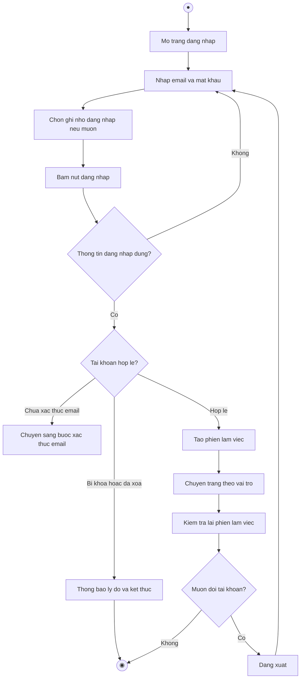

# 2.2.2.1 Mô hình hóa quy trình nghiệp vụ Đăng nhập hệ thống

> **Tác nhân**: Khách, Sinh viên, Giảng viên, Admin · **Tài liệu kỹ thuật**: [file #1](../01-dang-nhap-dang-ky-quen-mat-khau.md) · **Test case**: `TC-AUTH`

## a. Bằng văn bản

**Use case nghiệp vụ: Đăng nhập hệ thống**

Use case bắt đầu khi người dùng đã có tài khoản trong hệ thống quản lý đồ án môn học cần truy cập để sử dụng các chức năng theo vai trò của mình.

**Các dòng cơ bản:**

1. Người dùng mở trang đăng nhập của hệ thống.
2. Người dùng nhập email và mật khẩu.
3. Người dùng chọn ghi nhớ đăng nhập nếu muốn.
4. Người dùng bấm nút đăng nhập.
5. Hệ thống kiểm tra thông tin đăng nhập.
6. Hệ thống kiểm tra trạng thái tài khoản (bị khóa, đã xóa, đã xác thực email).
7. Hệ thống tạo phiên làm việc và chuyển người dùng đến trang chức năng theo vai trò.
8. Người dùng kiểm tra lại thông tin phiên làm việc trên thanh điều hướng.

**Các dòng thay thế**

Tại bước 5: Nếu email hoặc mật khẩu không đúng thì hệ thống thông báo lỗi và quay lại bước 2.

Tại bước 6: Nếu tài khoản đang bị khóa hoặc đã bị xóa thì hệ thống hủy phiên, thông báo lý do và kết thúc use case.

Tại bước 6: Nếu tài khoản chưa xác thực email thì hệ thống chuyển sang bước yêu cầu xác thực email (hiện hệ thống chưa khai báo trang này nên phát sinh lỗi 500 — xem ghi chú).

Tại bước 7: Nếu vai trò không thuộc ba nhóm sinh viên, giảng viên, quản trị viên thì hệ thống chuyển về trang mặc định.

Tại bước 8: Nếu người dùng muốn đổi tài khoản thì bấm đăng xuất và quay lại bước 1, ngược lại kết thúc use case.

## b. Sơ đồ hoạt động

Đối chiếu code:  → ; , , ,  (middleware ); điều hướng  /  / .
