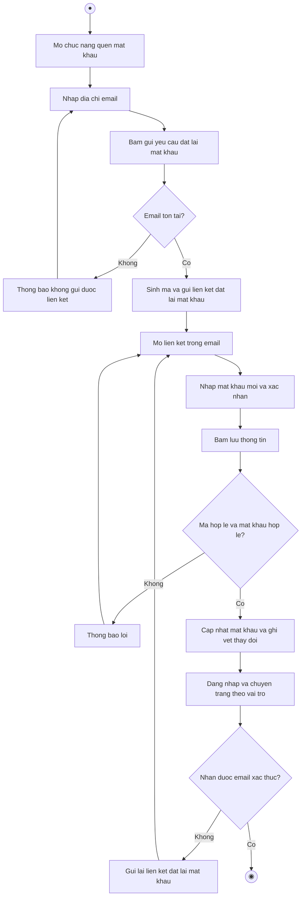

# 2.2.2.2 Mô hình hóa quy trình nghiệp vụ Quên và đặt lại mật khẩu

> **Tác nhân**: Khách · **Tài liệu kỹ thuật**: [file #1](../01-dang-nhap-dang-ky-quen-mat-khau.md) · **Test case**: `TC-AUTH`

## a. Bằng văn bản

**Use case nghiệp vụ: Quên và đặt lại mật khẩu**

Use case bắt đầu khi người dùng quên mật khẩu và không thể đăng nhập vào hệ thống quản lý đồ án môn học, cần thiết lập lại mật khẩu thông qua địa chỉ email đã đăng ký.

**Các dòng cơ bản:**

1. Người dùng mở chức năng quên mật khẩu.
2. Người dùng nhập địa chỉ email của tài khoản.
3. Người dùng bấm nút gửi yêu cầu đặt lại mật khẩu.
4. Hệ thống kiểm tra email và gửi liên kết đặt lại mật khẩu đến hộp thư của người dùng.
5. Người dùng mở liên kết trong email.
6. Người dùng nhập mật khẩu mới và xác nhận mật khẩu.
7. Người dùng bấm lưu; hệ thống kiểm tra mã, cập nhật mật khẩu mới và ghi vết thay đổi.
8. Hệ thống đăng nhập người dùng và chuyển đến trang chức năng theo vai trò.

**Các dòng thay thế**

Tại bước 4: Nếu email không tồn tại trong hệ thống thì hệ thống không gửi thư, thông báo không gửi được liên kết và quay lại bước 2.

Tại bước 4: Nếu cấu hình gửi thư bị lỗi thì hệ thống ghi nhật ký, thông báo không gửi được email và quay lại bước 2.

Tại bước 7: Nếu liên kết đã hết hạn hoặc mã đặt lại mật khẩu không hợp lệ thì hệ thống thông báo liên kết không hợp lệ hoặc đã hết hạn và quay lại bước 5.

Tại bước 7: Nếu mật khẩu mới ngắn hơn 6 ký tự hoặc xác nhận mật khẩu không khớp thì hệ thống thông báo lỗi và quay lại bước 6.

Tại bước 8: Nếu người dùng chưa nhận được email thì chọn gửi lại liên kết và quay lại bước 5.

## b. Sơ đồ hoạt động

Đối chiếu code: `GET/POST /forgot-password` (`password.request`, `password.email`) → `Auth\PasswordResetLinkController`; `GET/POST /reset-password` (`password.reset`, `password.store`) → `Auth\NewPasswordController`; bảng `password_reset_tokens`, `password_histories` (`PasswordAuditService`).
