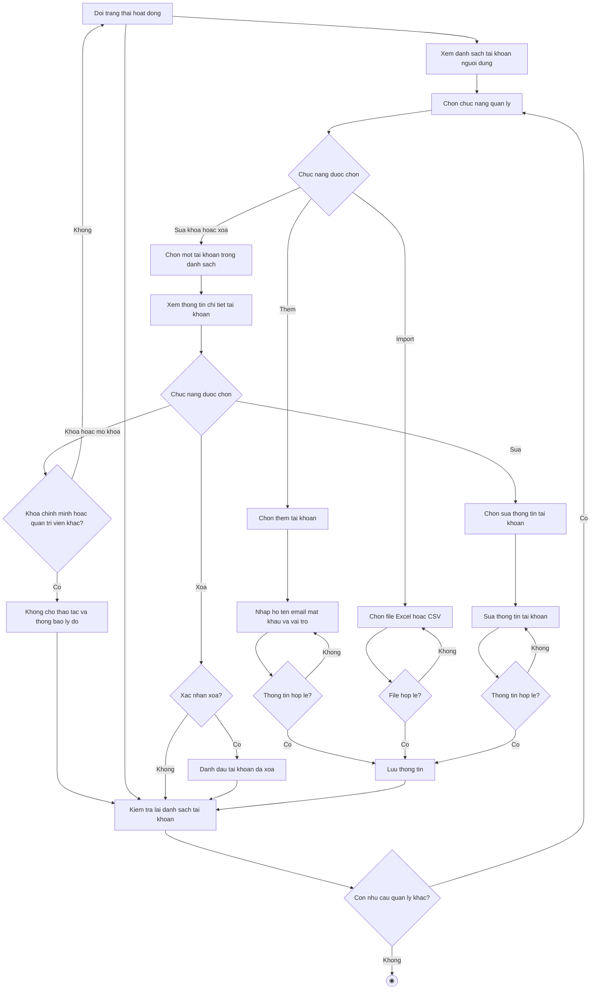

# 2.2.2.3 Mô hình hóa quy trình nghiệp vụ Quản lý tài khoản người dùng

> **Tác nhân**: Admin · **Tài liệu kỹ thuật**: [file #2](../02-quan-ly-nguoi-dung.md) · **Test case**: `TC-ADMIN`
> ⚠️ Hệ thống **không cho tự đăng ký**; tài khoản do quản trị viên tạo hoặc import (xem dòng thay thế).

## a. Bằng văn bản

**Use case nghiệp vụ: Quản lý tài khoản người dùng**

Use case bắt đầu khi quản trị viên cần thêm mới, cập nhật hoặc kiểm tra thông tin tài khoản người dùng để đảm bảo mọi thành viên của trường truy cập hệ thống đúng vai trò.

**Các dòng cơ bản:**

1. Quản trị viên mở chức năng quản lý người dùng và xem danh sách tài khoản.
2. Quản trị viên chọn chức năng quản lý.
3. Quản trị viên chọn một tài khoản trong danh sách.
4. Quản trị viên xem thông tin chi tiết tài khoản (kèm lịch sử đổi mật khẩu; nếu tài khoản là giảng viên thì hiện danh sách lớp phụ trách, nếu là sinh viên thì hiện danh sách lớp kèm trạng thái Đang học/Đã rời và danh sách nhóm kèm vai trò + trạng thái đề tài).
5. Quản trị viên chọn sửa thông tin tài khoản.
6. Quản trị viên sửa thông tin tài khoản (họ tên, email, vai trò, mật khẩu nếu cần).
7. Quản trị viên lưu thông tin.
8. Quản trị viên kiểm tra lại danh sách tài khoản.

**Các dòng thay thế**

Tại bước 2: Nếu quản trị viên chọn chức năng thêm thì qua bước 3:

- Quản trị viên chọn thêm tài khoản
- Quản trị viên nhập họ tên, email, mật khẩu và vai trò
- Nếu thông tin không hợp lệ (email đã tồn tại, mật khẩu dưới 6 ký tự, vai trò không hợp lệ), quay lại bước trước. Ngược lại tiếp tục bước 7

Tại bước 2: Nếu quản trị viên chọn chức năng import thì qua bước 3:

- Quản trị viên chọn file Excel hoặc CSV và bấm import
- Nếu file sai định dạng thì quay lại bước trước. Ngược lại hệ thống cập nhật tài khoản đã có theo email, tạo mới tài khoản còn thiếu, bỏ qua dòng sai định dạng và tiếp tục bước 7

Tại bước 4: Nếu quản trị viên chọn khóa hoặc mở khóa tài khoản thì bỏ qua bước 5, 6:

- Nếu tài khoản là của chính quản trị viên đang đăng nhập hoặc của quản trị viên khác thì hệ thống không cho thao tác, thông báo lý do và tiếp tục bước 8
- Ngược lại hệ thống đổi trạng thái hoạt động của tài khoản và tiếp tục bước 8

Tại bước 4: Nếu quản trị viên chọn xóa tài khoản thì bỏ qua bước 5, 6:

- Nếu quản trị viên không xác nhận xóa thì tiếp tục bước 8
- Ngược lại hệ thống đánh dấu tài khoản đã xóa (xóa mềm) và tiếp tục bước 8

Tại bước 6: Nếu thông tin tài khoản không hợp lệ, quay lại bước 6

Tại bước 8: Nếu quản trị viên còn nhu cầu quản lý tài khoản khác thì quay lại bước 2, ngược lại kết thúc use case

## b. Sơ đồ hoạt động

Đối chiếu code: ,  →  + ; cờ , /, ; ghi vết .
