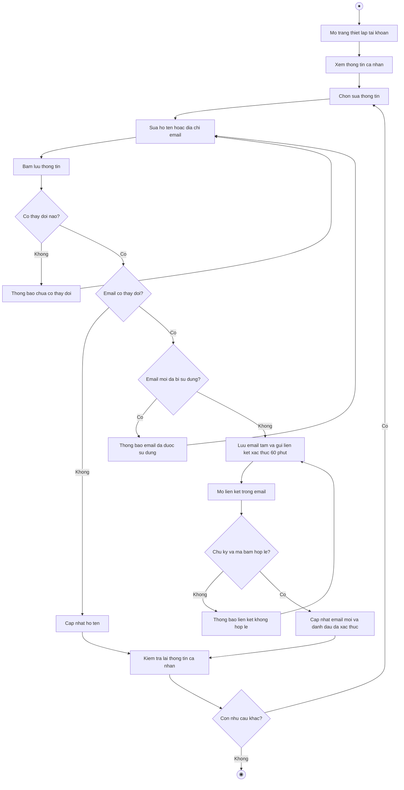

# 2.2.2.4 Mô hình hóa quy trình nghiệp vụ Cập nhật hồ sơ và đổi email

> **Tác nhân**: Sinh viên, Giảng viên, Admin · **Tài liệu kỹ thuật**: [file #1](../01-dang-nhap-dang-ky-quen-mat-khau.md) · **Test case**: `TC-AUTH`

## a. Bằng văn bản

**Use case nghiệp vụ: Cập nhật hồ sơ và đổi email**

Use case bắt đầu khi người dùng cần cập nhật thông tin cá nhân hoặc thay đổi địa chỉ email dùng để đăng nhập, đảm bảo hệ thống luôn liên hệ được với đúng người dùng.

**Các dòng cơ bản:**

1. Người dùng mở trang thiết lập tài khoản và chọn mục thông tin cá nhân.
2. Người dùng xem thông tin cá nhân hiện tại.
3. Người dùng chọn sửa thông tin.
4. Người dùng sửa họ tên hoặc địa chỉ email.
5. Người dùng bấm lưu thông tin.
6. Hệ thống kiểm tra dữ liệu và lưu thay đổi (chỉ đổi họ tên thì cập nhật ngay).
7. Nếu đổi email, hệ thống gửi liên kết xác thực đến địa chỉ email mới và giữ nguyên email cũ để đăng nhập.
8. Người dùng mở liên kết trong email; hệ thống xác nhận và cập nhật email mới.
9. Người dùng kiểm tra lại thông tin cá nhân.

**Các dòng thay thế**

Tại bước 5: Nếu người dùng không thay đổi thông tin nào thì hệ thống thông báo chưa có thay đổi nào để cập nhật và quay lại bước 4.

Tại bước 6: Nếu địa chỉ email mới đã thuộc tài khoản khác thì hệ thống thông báo email đã được sử dụng và quay lại bước 4.

Tại bước 7: Nếu hệ thống không gửi được email xác thực thì thông báo kiểm tra cấu hình gửi thư và quay lại bước 4.

Tại bước 8: Nếu liên kết đã hết hạn sau 60 phút hoặc sai chữ ký thì hệ thống thông báo liên kết không hợp lệ; người dùng chọn gửi lại liên kết và quay lại bước 7.

Tại bước 8: Nếu email mới bị tài khoản khác chiếm giữa trong lúc chờ xác thực thì hệ thống từ chối cập nhật và quay lại bước 4.

Tại bước 9: Nếu người dùng còn muốn đổi mật khẩu thì chuyển sang mục mật khẩu của thiết lập tài khoản, ngược lại kết thúc use case.

## b. Sơ đồ hoạt động

Đối chiếu code: `users.profile.info`, `users.profile.update` → `UserController::editProfile()/updateProfile()`; `users.email.verify` (middleware `signed`, `URL::temporarySignedRoute` 60 phút, `hash = sha1(email)`), `users.email.resend`; cột `users.pending_email`.
