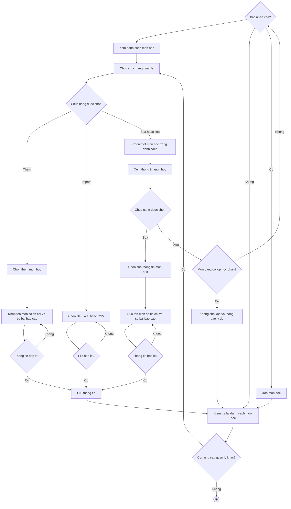

# 2.2.2.5 Mô hình hóa quy trình nghiệp vụ Quản lý môn học

> **Tác nhân**: Admin · **Tài liệu kỹ thuật**: [file #3](../03-quan-ly-mon-hoc.md) · **Test case**: `TC-ADMIN`

## a. Bằng văn bản

**Use case nghiệp vụ: Quản lý môn học**

Use case bắt đầu khi quản trị viên cần thêm mới, cập nhật hoặc kiểm tra thông tin môn học để đảm bảo danh mục môn học sẵn sàng cho việc mở lớp học phần và khai báo đồ án.

**Các dòng cơ bản:**

1. Quản trị viên mở chức năng quản lý môn học và xem danh sách môn học.
2. Quản trị viên chọn chức năng quản lý.
3. Quản trị viên chọn một môn học trong danh sách.
4. Quản trị viên xem thông tin môn học (tên môn, mã môn, số tín chỉ, số bài báo cáo, số lớp đang sử dụng).
5. Quản trị viên chọn sửa thông tin môn học.
6. Quản trị viên sửa thông tin môn học (tên môn, số tín chỉ, số bài báo cáo).
7. Quản trị viên lưu thông tin.
8. Quản trị viên kiểm tra lại danh sách môn học.

**Các dòng thay thế**

Tại bước 2: Nếu quản trị viên chọn chức năng thêm thì qua bước 3:

- Quản trị viên chọn thêm môn học
- Quản trị viên nhập tên môn, số tín chỉ và chọn số bài báo cáo (một bài hoặc hai bài)
- Nếu thông tin không hợp lệ (bỏ trống tên môn, số tín chỉ ngoài khoảng 1 đến 10, số bài báo cáo khác 1 và 2) thì quay lại bước trước. Ngược lại hệ thống sinh mã môn tự động và tiếp tục bước 7

Tại bước 2: Nếu quản trị viên chọn chức năng import thì qua bước 3:

- Quản trị viên chọn file Excel hoặc CSV và bấm import
- Nếu file sai định dạng hoặc vượt quá 5MB thì quay lại bước trước. Ngược lại hệ thống cập nhật số tín chỉ của môn đã tồn tại theo tên, tạo mới môn còn thiếu và tiếp tục bước 7
- Nếu file có dòng lỗi thì hệ thống vẫn import các dòng hợp lệ và thông báo danh sách dòng lỗi

Tại bước 4: Nếu quản trị viên chọn xóa môn học thì bỏ qua bước 5, 6:

- Nếu môn học đang có lớp học phần hoạt động thì hệ thống không cho xóa, thông báo lý do và tiếp tục bước 8
- Nếu quản trị viên không xác nhận xóa thì tiếp tục bước 8
- Ngược lại hệ thống xóa môn học và tiếp tục bước 8

Tại bước 6: Nếu thông tin môn học không hợp lệ thì quay lại bước 6. Nếu quản trị viên để trống số bài báo cáo thì hệ thống giữ nguyên giá trị hiện tại

Tại bước 8: Nếu quản trị viên còn nhu cầu quản lý môn học khác thì quay lại bước 2, ngược lại kết thúc use case

## b. Sơ đồ hoạt động

Đối chiếu code: `admin.subjects.index/create/store/edit/update/destroy`, `admin.subjects.import.form/import`, `admin.subjects.download-template` → `SubjectController` + `App\Imports\SubjectsImport`; `SubjectCodeService::generate()`; cột `subjects.subject_code`, `credits`, `report_count`.
