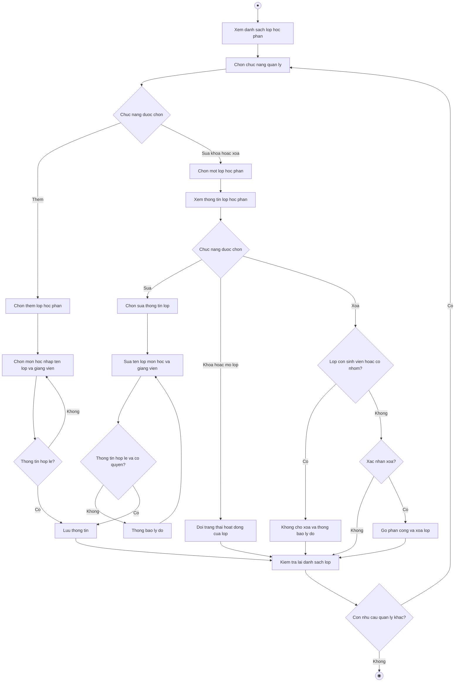

# 2.2.2.6 Mô hình hóa quy trình nghiệp vụ Quản lý lớp học phần

> **Tác nhân**: Admin, Giảng viên · **Tài liệu kỹ thuật**: [file #4](../04-quan-ly-lop-hoc-phan.md) · **Test case**: `TC-ADMIN`, `TC-LECT`

## a. Bằng văn bản

**Use case nghiệp vụ: Quản lý lớp học phần**

Use case bắt đầu khi quản trị viên hoặc giảng viên cần thêm mới, cập nhật hoặc kiểm tra thông tin lớp học phần để đảm bảo lớp sẵn sàng cho sinh viên tham gia, lập nhóm và đăng ký đồ án.

**Các dòng cơ bản:**

1. Quản trị viên hoặc giảng viên mở chức năng quản lý lớp học phần và xem danh sách lớp.
2. Quản trị viên hoặc giảng viên chọn chức năng quản lý.
3. Quản trị viên hoặc giảng viên chọn một lớp học phần trong danh sách.
4. Quản trị viên hoặc giảng viên xem thông tin lớp học phần (tên lớp, mã lớp, môn học, giảng viên phụ trách, số sinh viên, số nhóm).
5. Quản trị viên hoặc giảng viên chọn sửa thông tin lớp.
6. Quản trị viên hoặc giảng viên sửa thông tin lớp (tên lớp, môn học, giảng viên phụ trách).
7. Quản trị viên hoặc giảng viên lưu thông tin.
8. Quản trị viên hoặc giảng viên kiểm tra lại danh sách lớp học phần.

**Các dòng thay thế**

Tại bước 2: Nếu người dùng chọn chức năng thêm thì qua bước 3:

- Người dùng chọn thêm lớp học phần
- Người dùng chọn môn học, nhập tên lớp và chọn giảng viên phụ trách
- Nếu thông tin không hợp lệ (tên lớp đã tồn tại, chưa chọn môn học) thì quay lại bước trước. Ngược lại hệ thống sinh mã lớp tự động, lưu lớp ở trạng thái đang mở và tiếp tục bước 7

Tại bước 4: Nếu người dùng chọn khóa hoặc mở khóa lớp thì bỏ qua bước 5, 6:

- Hệ thống đổi trạng thái hoạt động của lớp và tiếp tục bước 8
- Lưu ý: lớp bị khóa thì sinh viên không thể tham gia bằng mã lớp

Tại bước 4: Nếu người dùng chọn xóa lớp thì bỏ qua bước 5, 6:

- Nếu lớp đang có sinh viên hoặc đã có nhóm hoạt động thì hệ thống không cho xóa, thông báo lý do và tiếp tục bước 8
- Nếu người dùng không xác nhận xóa thì tiếp tục bước 8
- Ngược lại hệ thống gỡ toàn bộ phân công và xóa lớp, sau đó tiếp tục bước 8

Tại bước 5: Nếu giảng viên thao tác trên lớp không thuộc quyền phụ trách thì hệ thống chuyển về danh sách lớp của giảng viên, thông báo lý do và tiếp tục bước 8

Tại bước 6: Nếu thông tin lớp không hợp lệ thì quay lại bước 6. Khi đổi giảng viên phụ trách, hệ thống thay danh sách giảng viên hiện tại bằng giảng viên mới được chọn

Tại bước 8: Nếu người dùng còn nhu cầu quản lý lớp khác thì quay lại bước 2, ngược lại kết thúc use case

## b. Sơ đồ hoạt động

Đối chiếu code: `admin.classes.*` (index/create/store/show/edit/update/destroy/toggle-active) và `lecturer.classes.*` → `ClassSectionController`; **L07**: mã lớp do `generateUniqueClassCode()` sinh ĐÚNG 5 ký tự (admin + giảng viên dùng chung, bỏ generator cũ `generateClassCode()` kiểu `{subject_code}-NN`); sinh viên tham gia bằng `ClassJoinController::joinByCode()` (validate `size:5`); bảng `class_sections`, pivot `user_classes`; route cũ `classes.index` chuyển hướng về `admin.classes.index`.
