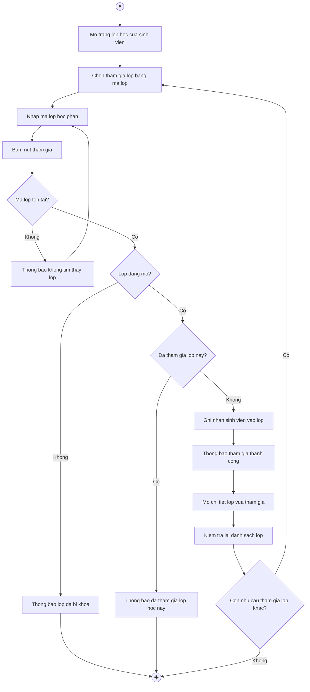

# 2.2.2.7 Mô hình hóa quy trình nghiệp vụ Tham gia lớp học phần

> **Tác nhân**: Sinh viên · **Tài liệu kỹ thuật**: [file #4](../04-quan-ly-lop-hoc-phan.md) · **Test case**: `TC-LECT`

## a. Bằng văn bản

**Use case nghiệp vụ: Tham gia lớp học phần**

Use case bắt đầu khi sinh viên nhận được mã lớp từ giảng viên phụ trách và cần tham gia lớp học phần để xem đồ án, lập nhóm và theo dõi bảng tin của lớp.

**Các dòng cơ bản:**

1. Sinh viên mở trang lớp học của mình và xem danh sách lớp đã tham gia.
2. Sinh viên chọn chức năng tham gia lớp bằng mã lớp.
3. Sinh viên nhập mã lớp học phần.
4. Sinh viên bấm nút tham gia.
5. Hệ thống kiểm tra mã lớp, trạng thái lớp và tình trạng tham gia của sinh viên.
6. Hệ thống ghi nhận sinh viên vào lớp và thông báo kết quả.
7. Sinh viên mở chi tiết lớp vừa tham gia.
8. Sinh viên kiểm tra lại danh sách lớp của mình.

**Các dòng thay thế**

Tại bước 5: Nếu mã lớp không tồn tại thì hệ thống thông báo không tìm thấy lớp học với mã này và quay lại bước 3.

Tại bước 5: Nếu lớp đã bị khóa thì hệ thống thông báo lớp đã bị khóa, không thể tham gia và kết thúc use case.

Tại bước 5: Nếu sinh viên đã tham gia lớp này rồi thì hệ thống thông báo đã tham gia lớp học này và kết thúc use case.

Tại bước 7: Nếu sinh viên mở chi tiết một lớp mình chưa tham gia thì hệ thống chuyển về danh sách lớp, thông báo chưa tham gia lớp học này và tiếp tục bước 8.

Tại bước 8: Nếu sinh viên muốn tham gia thêm lớp khác thì quay lại bước 2, ngược lại kết thúc use case.

## b. Sơ đồ hoạt động

Đối chiếu code: `POST user/classes/join` (`user.join-class`) → `ClassJoinController::joinByCode()`; kiểm tra `class_sections.class_code`, `class_sections.is_active`, pivot `user_classes`; danh sách lớp `user.classes`, chi tiết lớp `user.class_detail` → `UserDashboardController::classes()/classDetail()`.
