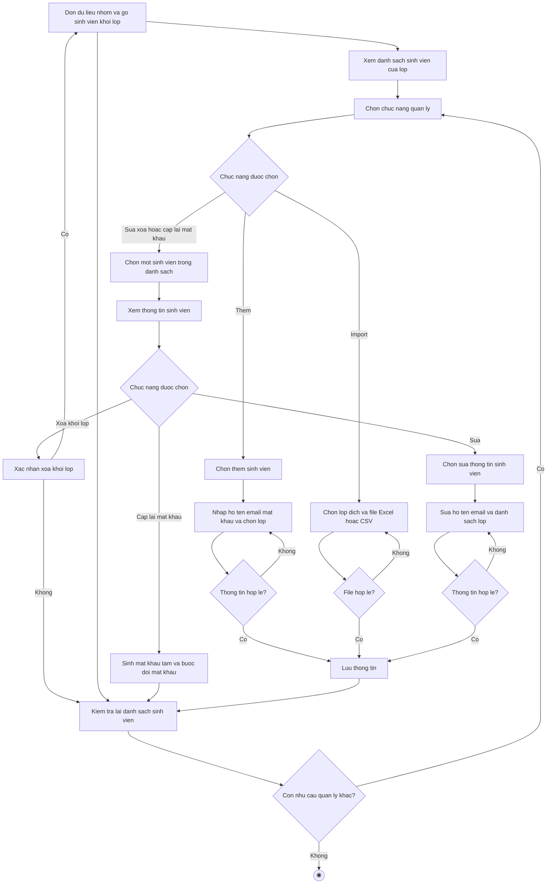

# 2.2.2.8 Mô hình hóa quy trình nghiệp vụ Quản lý sinh viên trong lớp học phần

> **Tác nhân**: Admin, Giảng viên · **Tài liệu kỹ thuật**: [file #5](../05-quan-ly-sinh-vien-trong-lop.md) · **Test case**: `TC-ADMIN`, `TC-LECT`

## a. Bằng văn bản

**Use case nghiệp vụ: Quản lý sinh viên trong lớp học phần**

Use case bắt đầu khi quản trị viên hoặc giảng viên cần thêm mới, cập nhật hoặc kiểm tra danh sách sinh viên của một lớp học phần để phục vụ việc chia nhóm và phân công đồ án.

**Các dòng cơ bản:**

1. Quản trị viên hoặc giảng viên mở chức năng quản lý sinh viên và xem danh sách sinh viên của lớp.
2. Quản trị viên hoặc giảng viên chọn chức năng quản lý.
3. Quản trị viên hoặc giảng viên chọn một sinh viên trong danh sách.
4. Quản trị viên hoặc giảng viên xem thông tin sinh viên (họ tên, email, lớp đang học, nhóm đang tham gia).
5. Quản trị viên hoặc giảng viên chọn sửa thông tin sinh viên.
6. Quản trị viên hoặc giảng viên sửa thông tin sinh viên (họ tên, email, mật khẩu nếu cần, danh sách lớp).
7. Quản trị viên hoặc giảng viên lưu thông tin.
8. Quản trị viên hoặc giảng viên kiểm tra lại danh sách sinh viên.

**Các dòng thay thế**

Tại bước 2: Nếu người dùng chọn chức năng thêm thì qua bước 3:

- Người dùng chọn thêm sinh viên, nhập họ tên, email, mật khẩu và chọn một hoặc nhiều lớp học phần
- Nếu email đã thuộc tài khoản giảng viên hoặc quản trị viên, hoặc chưa chọn lớp nào thì quay lại bước trước
- Nếu email đã thuộc một sinh viên khác thì hệ thống cập nhật thông tin sinh viên đó và gán thêm lớp mới. Ngược lại hệ thống tạo tài khoản sinh viên mới. Sau đó tiếp tục bước 7

Tại bước 2: Nếu người dùng chọn chức năng import thì qua bước 3:

- Người dùng chọn lớp đích và file Excel hoặc CSV rồi bấm import
- Hệ thống xử lý từng dòng: cập nhật sinh viên đã có theo email, tạo sinh viên mới, bỏ qua dòng không phải sinh viên, rồi tiếp tục bước 7

Tại bước 4: Nếu người dùng chọn xóa sinh viên khỏi lớp thì bỏ qua bước 5, 6:

- Nếu sinh viên đang là thành viên hoặc trưởng nhóm thì hệ thống dọn dữ liệu nhóm (rời nhóm, chuyển quyền trưởng nhóm hoặc giải tán nhóm nếu không còn thành viên, làm hết hiệu lực lời mời và yêu cầu còn chờ) rồi gỡ sinh viên khỏi lớp
- Nếu người dùng không xác nhận xóa thì tiếp tục bước 8
- Ngược lại hệ thống gỡ sinh viên khỏi lớp và tiếp tục bước 8

Tại bước 4: Nếu người dùng chọn cấp lại mật khẩu thì hệ thống sinh mật khẩu tạm 8 ký tự, buộc sinh viên đổi mật khẩu ở lần đăng nhập tiếp theo và tiếp tục bước 8

Tại bước 6: Nếu thông tin sinh viên không hợp lệ thì quay lại bước 6. Nếu sinh viên bị bỏ khỏi một lớp thì hệ thống dọn dữ liệu nhóm tương ứng

Tại bước 8: Nếu người dùng còn nhu cầu quản lý sinh viên khác thì quay lại bước 2, ngược lại kết thúc use case

## b. Sơ đồ hoạt động

Đối chiếu code: `students.*` (index/create/store/show/edit/update/destroy/import/export/reset-password/send-email/check-email) → `StudentController`; `admin.classes.students.add/remove`, `lecturer.classes.students.add/remove` → `ClassSectionController`; `App\Imports\StudentsImport`; `GroupService::removeUserFromClassGroups()`; cột `users.must_change_password`.
