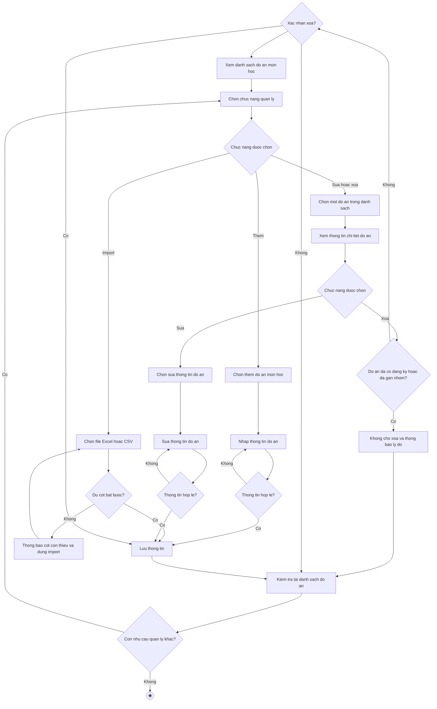

# 2.2.2.9 Mô hình hóa quy trình nghiệp vụ Quản lý đồ án môn học

> **Tác nhân**: Giảng viên, Admin · **Tài liệu kỹ thuật**: [file #6](../06-quan-ly-de-tai-va-import.md) · **Test case**: `TC-STU`
> Trong hệ thống, "đồ án môn học" được gọi là **đề tài** (`topics`); mỗi đồ án thuộc một lớp học phần.

## a. Bằng văn bản

**Use case nghiệp vụ: Quản lý đồ án môn học**

Use case bắt đầu khi giảng viên phụ trách lớp học phần cần thêm mới, cập nhật hoặc kiểm tra thông tin đồ án môn học để đảm bảo danh sách đồ án luôn sẵn sàng cho sinh viên tìm hiểu và đăng ký thực hiện.

**Các dòng cơ bản:**

1. Giảng viên mở chức năng quản lý đồ án môn học và xem danh sách đồ án.
2. Giảng viên chọn chức năng quản lý.
3. Giảng viên chọn một đồ án trong danh sách.
4. Giảng viên xem thông tin chi tiết đồ án.
5. Giảng viên chọn sửa thông tin đồ án.
6. Giảng viên sửa thông tin đồ án.
7. Giảng viên lưu thông tin.
8. Giảng viên kiểm tra lại danh sách đồ án.

**Các dòng thay thế**

Tại bước 2: Nếu giảng viên chọn chức năng thêm thì qua bước 3:

- Giảng viên chọn thêm đồ án
- Giảng viên nhập thông tin đồ án (tên đồ án, mô tả, mục tiêu, yêu cầu, lớp học phần, số thành viên tối thiểu, số thành viên tối đa, hạn đăng ký, loại báo cáo)
- Nếu thông tin không hợp lệ (bỏ trống tên đồ án, tên đồ án đã tồn tại, mô tả dưới 10 ký tự, chưa chọn lớp học phần, lớp học phần không thuộc quyền phụ trách, số thành viên tối đa nhỏ hơn số thành viên tối thiểu) thì quay lại bước trước. Ngược lại tiếp tục bước 7

Tại bước 2: Nếu giảng viên chọn chức năng import thì qua bước 3:

- Giảng viên chọn file Excel hoặc CSV và bấm import
- Nếu file thiếu dòng tiêu đề hoặc thiếu cột bắt buộc (tên đồ án, mô tả, mã lớp) thì hệ thống dừng import, thông báo các cột cần có và quay lại bước trước
- Ngược lại hệ thống thêm mới các đồ án hợp lệ, bỏ qua đồ án trùng tên và thông báo số dòng lỗi (nếu có), rồi tiếp tục bước 7

Tại bước 4: Nếu giảng viên chọn xóa đồ án thì bỏ qua bước 5, 6:

- Giảng viên chọn xóa đồ án
- Nếu giảng viên không xác nhận xóa đồ án thì tiếp tục bước 8
- Ngược lại thực hiện bước 7
- Nếu đồ án đã có nhóm đăng ký hoặc đã được gán cho nhóm thì hệ thống không cho xóa, thông báo lý do và tiếp tục bước 8

Tại bước 4: Nếu đồ án đã có sinh viên đăng ký (đang chờ duyệt hoặc đã được duyệt) thì hệ thống không cho sửa, thông báo lý do và tiếp tục bước 8

Tại bước 6: Nếu thông tin đồ án không hợp lệ thì quay lại bước 6. Lưu ý khi sửa, hệ thống không cho thay đổi lớp học phần, môn học và giảng viên phụ trách của đồ án

Tại bước 8: Nếu giảng viên còn nhu cầu quản lý đồ án khác thì quay lại bước 2, ngược lại kết thúc use case

## b. Sơ đồ hoạt động

Đối chiếu code: `topics.*` (index/create/store/show/edit/update/destroy) và `topics.import.form/import/download-template` → `TopicController` + `App\Imports\TopicsImport` + `TopicsHeadingRowImport`; `resolveReportType()`; cột `topics.class_id`, `subject_id`, `lecturer`, `min_members`, `max_members`, `registration_deadline`, `report_type`, `assigned_group_id`.
