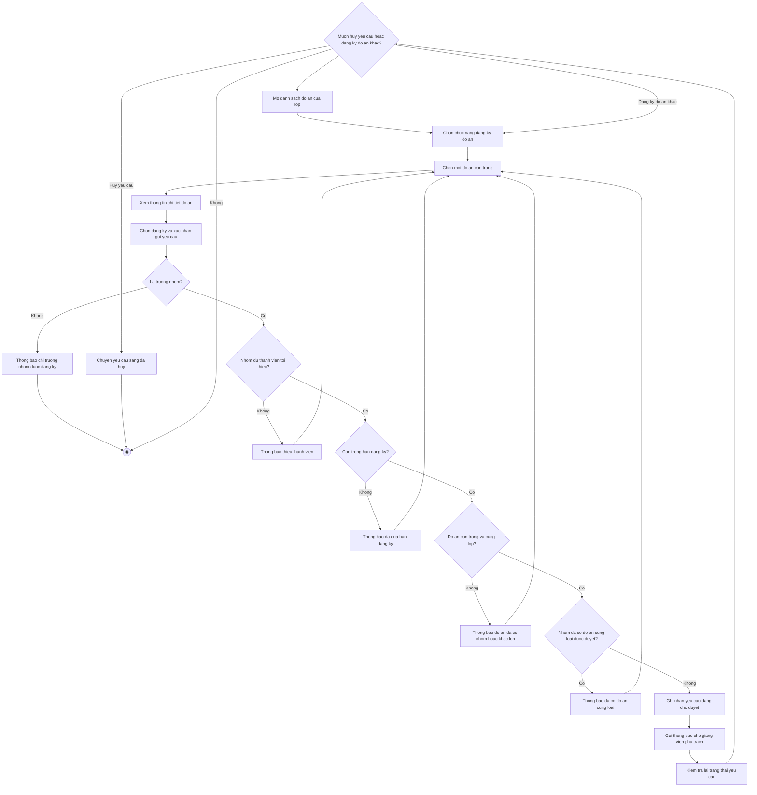

# 2.2.2.10 Mô hình hóa quy trình nghiệp vụ Đăng ký đồ án cho nhóm

> **Tác nhân**: Trưởng nhóm (sinh viên) · **Tài liệu kỹ thuật**: [file #7](../07-dang-ky-de-tai-duyet-tu-choi.md) · **Test case**: `TC-STU`

## a. Bằng văn bản

**Use case nghiệp vụ: Đăng ký đồ án cho nhóm**

Use case bắt đầu khi trưởng nhóm đã thành lập nhóm và cần gửi yêu cầu đăng ký một đồ án môn học của lớp để nhóm chính thức triển khai thực hiện.

**Các dòng cơ bản:**

1. Trưởng nhóm mở danh sách đồ án của lớp học phần mà nhóm đang tham gia.
2. Trưởng nhóm chọn chức năng đăng ký đồ án.
3. Trưởng nhóm chọn một đồ án còn trống trong danh sách.
4. Trưởng nhóm xem thông tin chi tiết đồ án (mô tả, yêu cầu, số thành viên, hạn đăng ký, loại báo cáo).
5. Trưởng nhóm chọn đăng ký đồ án cho nhóm và xác nhận gửi yêu cầu.
6. Hệ thống kiểm tra các điều kiện đăng ký (vai trò trưởng nhóm, cùng lớp, số thành viên tối thiểu, hạn đăng ký, trạng thái đồ án, loại báo cáo).
7. Hệ thống ghi nhận yêu cầu ở trạng thái đang chờ duyệt và gửi thông báo cho giảng viên phụ trách.
8. Trưởng nhóm kiểm tra lại trạng thái yêu cầu trong trang đồ án của nhóm.

**Các dòng thay thế**

Tại bước 6: Nếu người gửi không phải trưởng nhóm thì hệ thống thông báo chỉ trưởng nhóm mới có thể đăng ký đồ án và kết thúc use case.

Tại bước 6: Nếu nhóm chưa đủ số thành viên tối thiểu thì hệ thống thông báo số thành viên cần có và số hiện có, rồi quay lại bước 3.

Tại bước 6: Nếu đã quá hạn đăng ký của đồ án thì hệ thống thông báo đã quá hạn đăng ký và quay lại bước 3.

Tại bước 6: Nếu đồ án đã được gán cho nhóm khác hoặc nhóm đã có đồ án cùng loại báo cáo được duyệt thì hệ thống thông báo lý do và quay lại bước 3.

Tại bước 6: Nếu nhóm từng bị từ chối chính đồ án này thì hệ thống chuyển yêu cầu cũ về trạng thái đang chờ duyệt, thông báo gửi lại yêu cầu thành công và tiếp tục bước 8.

Tại bước 8: Nếu trưởng nhóm muốn hủy yêu cầu khi yêu cầu chưa được duyệt thì chọn hủy đăng ký; hệ thống chuyển yêu cầu sang trạng thái đã hủy và kết thúc use case.

Tại bước 8: Nếu trưởng nhóm muốn đăng ký đồ án khác cho loại báo cáo còn lại thì quay lại bước 2, ngược lại kết thúc use case.

## b. Sơ đồ hoạt động

Đối chiếu code: `POST user/topics/register` (`user.register_topic`) → `UserDashboardController::registerTopic()` → `TopicRegistrationService::register()`; `DELETE user/topics/cancel/{requestId}` (`user.cancel-topic-request`) → `cancel()`; bảng `topic_requests` (`status` = Pending/Accepted/Rejected/Cancelled), `NotificationService::topicRequestCreated()`.
