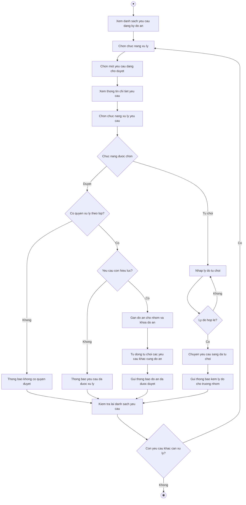

# 2.2.2.11 Mô hình hóa quy trình nghiệp vụ Duyệt và từ chối đăng ký đồ án

> **Tác nhân**: Giảng viên, Admin · **Tài liệu kỹ thuật**: [file #7](../07-dang-ky-de-tai-duyet-tu-choi.md) · **Test case**: `TC-STU`

## a. Bằng văn bản

**Use case nghiệp vụ: Duyệt và từ chối đăng ký đồ án**

Use case bắt đầu khi giảng viên phụ trách lớp nhận được yêu cầu đăng ký đồ án của nhóm sinh viên và cần xử lý yêu cầu đó để chốt phân công đồ án cho nhóm.

**Các dòng cơ bản:**

1. Giảng viên mở chức năng duyệt đăng ký đồ án và xem danh sách yêu cầu.
2. Giảng viên chọn chức năng xử lý (duyệt hoặc từ chối).
3. Giảng viên chọn một yêu cầu đang chờ duyệt.
4. Giảng viên xem thông tin chi tiết yêu cầu (nhóm, đồ án, lớp học phần, người gửi).
5. Giảng viên chọn chức năng xử lý yêu cầu.
6. Giảng viên thực hiện xử lý (nhập lý do nếu từ chối).
7. Giảng viên lưu kết quả xử lý.
8. Giảng viên kiểm tra lại danh sách yêu cầu.

**Các dòng thay thế**

Tại bước 5: Nếu giảng viên chọn duyệt yêu cầu:

- Nếu giảng viên không phụ trách lớp của đồ án thì hệ thống thông báo không có quyền duyệt yêu cầu này và tiếp tục bước 8
- Nếu yêu cầu đã được xử lý trước đó thì hệ thống thông báo yêu cầu đã được xử lý và tiếp tục bước 8
- Ngược lại hệ thống gán đồ án cho nhóm, đánh dấu đồ án đã có nhóm, tự động từ chối các yêu cầu còn chờ khác trên cùng đồ án và tiếp tục bước 7

Tại bước 5: Nếu giảng viên chọn từ chối yêu cầu thì bỏ qua bước 6:

- Giảng viên nhập lý do từ chối
- Nếu lý do vượt quá 500 ký tự thì quay lại bước trước
- Ngược lại hệ thống chuyển yêu cầu sang trạng thái đã từ chối, gửi thông báo kèm lý do cho trưởng nhóm và tiếp tục bước 7

Tại bước 7: Nếu đồ án được duyệt là đồ án cuối kì thì hệ thống ghi nhận đồ án chính thức cho nhóm; nếu là đồ án giữa kì thì chỉ ghi nhận ở yêu cầu đã duyệt. Khi môn học có hai bài báo cáo, việc duyệt đồ án giữa kì không làm hết hiệu lực yêu cầu cuối kì của nhóm

Tại bước 7: Nếu giảng viên muốn gán đồ án trực tiếp cho nhóm mà không qua đăng ký thì hệ thống vẫn kiểm tra đồ án đúng lớp, chưa thuộc nhóm khác và nhóm chưa có đồ án cùng loại trước khi gán

Tại bước 8: Nếu giảng viên còn yêu cầu khác cần xử lý thì quay lại bước 2, ngược lại kết thúc use case

## b. Sơ đồ hoạt động

Đối chiếu code: `GET topic-requests` (`topic_requests.index`), `PATCH topic-requests/{id}/approve` (`topic_requests.approve`), `PATCH topic-requests/{id}/reject` (`topic_requests.reject`) → `TopicRequestController` → `TopicRegistrationService::approve()/reject()/assignDirectly()`; `canReview()` (admin mọi yêu cầu, giảng viên chỉ lớp phụ trách); `NotificationService::topicRequestApproved()/topicRequestRejected()`.
