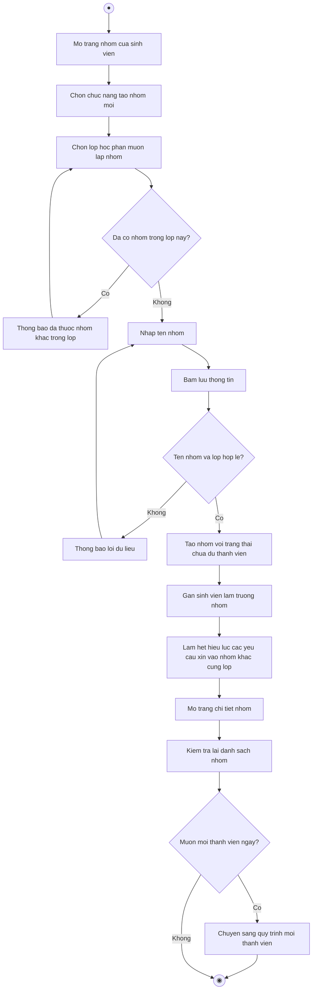

# 2.2.2.12 Mô hình hóa quy trình nghiệp vụ Thành lập nhóm

> **Tác nhân**: Sinh viên (trở thành trưởng nhóm) · **Tài liệu kỹ thuật**: [file #8](../08-nhom-loi-moi-yeu-cau-tham-gia.md) · **Test case**: `TC-STU`

## a. Bằng văn bản

**Use case nghiệp vụ: Thành lập nhóm**

Use case bắt đầu khi sinh viên đã tham gia lớp học phần và cần lập nhóm trong lớp đó để cùng thực hiện đồ án môn học.

**Các dòng cơ bản:**

1. Sinh viên mở trang nhóm và xem danh sách nhóm của mình.
2. Sinh viên chọn chức năng tạo nhóm mới.
3. Sinh viên chọn lớp học phần muốn lập nhóm.
4. Sinh viên nhập tên nhóm.
5. Sinh viên bấm lưu thông tin.
6. Hệ thống kiểm tra điều kiện và tạo nhóm mới, gán sinh viên làm trưởng nhóm với trạng thái chưa đủ thành viên.
7. Hệ thống mở trang chi tiết nhóm để trưởng nhóm tiếp tục mời thành viên.
8. Sinh viên kiểm tra lại danh sách nhóm của mình.

**Các dòng thay thế**

Tại bước 3: Nếu sinh viên đã có nhóm trong lớp học phần đã chọn thì hệ thống không cho tạo nhóm, thông báo đã thuộc một nhóm khác trong lớp này và quay lại bước 3.

Tại bước 3: Nếu sinh viên đã có nhóm ở tất cả các lớp đang tham gia thì hệ thống không hiển thị lựa chọn lớp, thông báo không thể tạo nhóm mới và kết thúc use case.

Tại bước 5: Nếu tên nhóm để trống hoặc lớp học phần không hợp lệ thì hệ thống thông báo lỗi và quay lại bước 4.

Tại bước 6: Nếu trưởng nhóm được chỉ định không phải là sinh viên thì hệ thống thông báo người được chỉ định làm trưởng nhóm phải là sinh viên và quay lại bước 4.

Tại bước 7: Nếu sinh viên có yêu cầu xin vào nhóm khác trong cùng lớp thì hệ thống tự động chuyển các yêu cầu đó sang trạng thái hết hiệu lực

Tại bước 8: Nếu trưởng nhóm muốn mời thành viên ngay thì chuyển sang quy trình mời thành viên (quan hệ `<<extend>>`: Mời thành viên mở rộng từ Tạo nhóm khi nhóm còn thiếu thành viên), ngược lại kết thúc use case

## b. Sơ đồ hoạt động

Đối chiếu code: `GET user/groups/create` (`user.create_group`), `POST user/groups/store` (`user.store_group`) → `UserDashboardController::createGroupForm()/storeGroup()` → `GroupService::createGroupByStudent()`; `hasGroupInClass()`; `InvitationService::expireMemberPendingRequestsInClass()`; bảng `groups` (`leader_id`, `class_id`, `status`).
