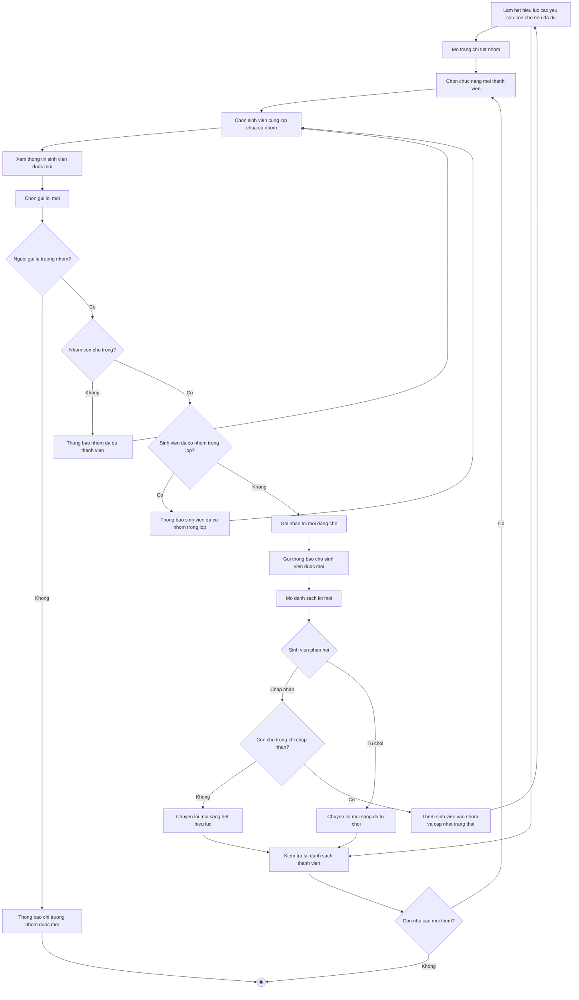

# 2.2.2.13 Mô hình hóa quy trình nghiệp vụ Mời thành viên và phản hồi lời mời

> **Tác nhân**: Trưởng nhóm, Sinh viên · **Tài liệu kỹ thuật**: [file #8](../08-nhom-loi-moi-yeu-cau-tham-gia.md) · **Test case**: `TC-STU`

## a. Bằng văn bản

**Use case nghiệp vụ: Mời thành viên và phản hồi lời mời**

Use case bắt đầu khi trưởng nhóm cần bổ sung thành viên cho nhóm mình và chọn những sinh viên cùng lớp chưa thuộc nhóm nào để gửi lời mời tham gia. Use case này là `<<extend>>` của use case Thành lập nhóm (2.2.2.12): được kích hoạt khi nhóm vừa tạo còn thiếu thành viên hoặc khi trưởng nhóm cần bổ sung thêm thành viên.

**Các dòng cơ bản:**

1. Trưởng nhóm mở trang chi tiết nhóm và xem thông tin nhóm, danh sách thành viên hiện tại.
2. Trưởng nhóm chọn chức năng mời thành viên.
3. Trưởng nhóm chọn một sinh viên cùng lớp chưa thuộc nhóm nào trong danh sách gợi ý.
4. Trưởng nhóm xem thông tin sinh viên được mời.
5. Trưởng nhóm chọn gửi lời mời.
6. Hệ thống kiểm tra quyền trưởng nhóm, số chỗ còn thiếu của nhóm và tình trạng nhóm của sinh viên được mời.
7. Hệ thống ghi nhận lời mời ở trạng thái đang chờ và gửi thông báo cho sinh viên được mời.
8. Sinh viên được mời mở danh sách lời mời và chọn chấp nhận hoặc từ chối.
9. Hệ thống cập nhật thành phần nhóm (nếu chấp nhận) và trưởng nhóm kiểm tra lại danh sách thành viên.

**Các dòng thay thế**

Tại bước 6: Nếu người gửi không phải trưởng nhóm thì hệ thống thông báo chỉ trưởng nhóm mới có thể mời thành viên và kết thúc use case.

Tại bước 6: Nếu nhóm đã đủ số thành viên tối đa thì hệ thống thông báo nhóm đã đủ thành viên, không thể mời thêm và quay lại bước 3.

Tại bước 6: Nếu số lời mời đang chờ đã bằng số chỗ còn thiếu của nhóm thì hệ thống yêu cầu chờ phản hồi hoặc hủy lời mời cũ và quay lại bước 3.

Tại bước 6: Nếu sinh viên được mời đã có nhóm trong lớp này, hoặc đã là thành viên của nhóm, hoặc đã có lời mời đang chờ thì hệ thống thông báo lý do tương ứng và quay lại bước 3.

Tại bước 8: Nếu sinh viên chọn từ chối thì hệ thống chuyển lời mời sang trạng thái đã từ chối và tiếp tục bước 9.

Tại bước 8: Nếu nhóm đã đủ thành viên tại thời điểm sinh viên chấp nhận thì hệ thống chuyển lời mời sang trạng thái hết hiệu lực, thông báo lời mời không còn hiệu lực và tiếp tục bước 9.

Tại bước 9: Nếu trưởng nhóm muốn hủy lời mời còn đang chờ thì chọn hủy lời mời; hệ thống xóa lời mời và kết thúc use case. Nếu sau khi chấp nhận lời mời mà nhóm đã đủ thành viên thì các yêu cầu tham gia còn chờ của nhóm tự động hết hiệu lực

## b. Sơ đồ hoạt động

Đối chiếu code: `GET user/groups/{groupId}/invite` (`user.invite-member`), `POST user/invites/send` (`user.send-invite`), `POST user/invites/{id}/accept|reject`, `DELETE user/invites/{inviteId}` (`user.cancel-invite`), `GET user/invites` (`user.invites`) → `UserDashboardController` + `InvitationService::sendInvite()/acceptInvite()/rejectInvite()/cancelInvite()`; `GroupService::isFull()/maxMembers()/hasGroupInClass()`; `NotificationService::groupInviteCreated()`.
