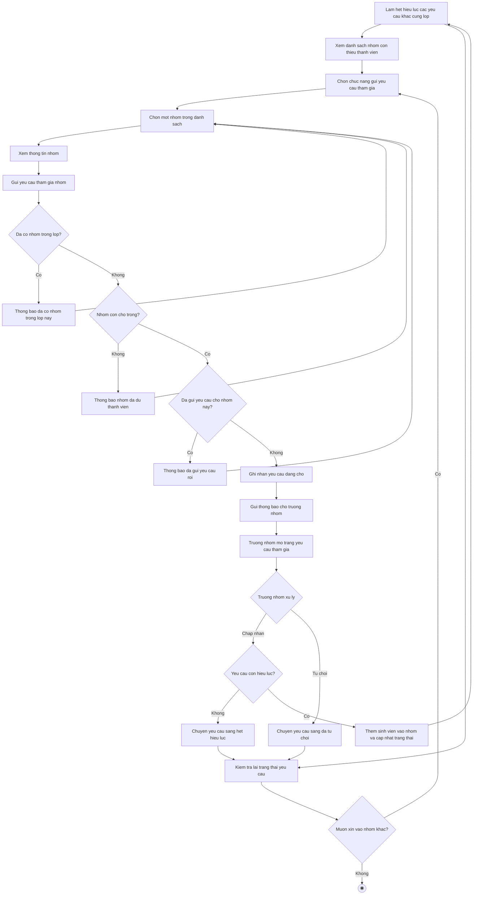

# 2.2.2.14 Mô hình hóa quy trình nghiệp vụ Yêu cầu tham gia nhóm

> **Tác nhân**: Sinh viên, Trưởng nhóm · **Tài liệu kỹ thuật**: [file #8](../08-nhom-loi-moi-yeu-cau-tham-gia.md) · **Test case**: `TC-STU`

## a. Bằng văn bản

**Use case nghiệp vụ: Yêu cầu tham gia nhóm**

Use case bắt đầu khi sinh viên chưa có nhóm trong một lớp học phần cần chủ động xin vào một nhóm còn thiếu thành viên của lớp đó để cùng thực hiện đồ án.

**Các dòng cơ bản:**

1. Sinh viên mở trang nhóm và xem danh sách nhóm còn thiếu thành viên của các lớp mình tham gia.
2. Sinh viên chọn chức năng gửi yêu cầu tham gia.
3. Sinh viên chọn một nhóm trong danh sách.
4. Sinh viên xem thông tin nhóm (trưởng nhóm, lớp học phần, số thành viên hiện có, số chỗ còn lại).
5. Sinh viên gửi yêu cầu tham gia nhóm.
6. Hệ thống kiểm tra tình trạng nhóm của sinh viên, số chỗ còn lại của nhóm và yêu cầu trùng.
7. Hệ thống ghi nhận yêu cầu ở trạng thái đang chờ và gửi thông báo cho trưởng nhóm.
8. Trưởng nhóm mở trang yêu cầu tham gia của nhóm và chọn chấp nhận hoặc từ chối.
9. Hệ thống cập nhật thành phần nhóm (nếu chấp nhận) và sinh viên kiểm tra lại trạng thái yêu cầu.

**Các dòng thay thế**

Tại bước 6: Nếu sinh viên đã có nhóm trong lớp này thì hệ thống thông báo đã có nhóm trong lớp và quay lại bước 3.

Tại bước 6: Nếu nhóm đã đủ thành viên thì hệ thống thông báo nhóm đã đủ số thành viên tối đa và quay lại bước 3.

Tại bước 6: Nếu sinh viên đã gửi yêu cầu cho nhóm này rồi thì hệ thống thông báo đã gửi yêu cầu tham gia nhóm này rồi và quay lại bước 3.

Tại bước 8: Nếu trưởng nhóm chọn từ chối thì hệ thống chuyển yêu cầu sang trạng thái đã từ chối và tiếp tục bước 9.

Tại bước 8: Nếu tại thời điểm trưởng nhóm xử lý mà nhóm đã đủ thành viên hoặc sinh viên đã có nhóm khác trong lớp thì hệ thống chuyển yêu cầu sang trạng thái hết hiệu lực, thông báo yêu cầu không còn hiệu lực và tiếp tục bước 9.

Tại bước 9: Nếu sinh viên muốn hủy yêu cầu khi yêu cầu còn đang chờ thì chọn hủy yêu cầu; hệ thống xóa yêu cầu khỏi danh sách và kết thúc use case.

Tại bước 9: Nếu sinh viên muốn xin vào nhóm khác thì quay lại bước 2, ngược lại kết thúc use case. Khi mở trang nhóm hoặc trang yêu cầu, hệ thống tự động dọn các yêu cầu đang chờ nhưng không còn hiệu lực sang trạng thái hết hiệu lực

## b. Sơ đồ hoạt động

Đối chiếu code: `GET user/available-groups` (`user.available_groups`), `POST user/join_requests/send` (`user.send-join-request`), `GET user/join_requests` (`user.join-requests`), `GET user/groups/{groupId}/join-requests` (`user.group-join-requests`), `POST user/join_requests/{requestId}/approve|reject`, `DELETE user/join_requests/{id}` (`user.cancel-request`) → `UserDashboardController` + `InvitationService::sendJoinRequest()/approveJoinRequest()/rejectJoinRequest()/cancelJoinRequest()/canHandleJoinRequest()/expireStalePendingRequestsFor()`; sự kiện `JoinRequestCreated`, `JoinRequestResolved`.
