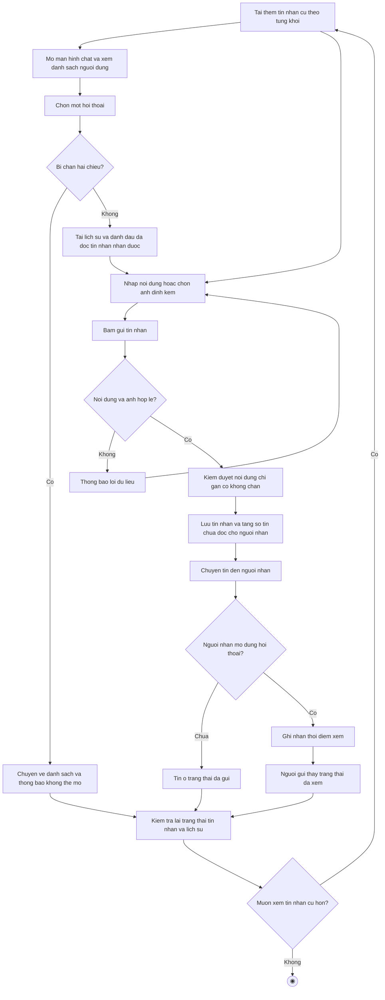

# 2.2.2.15 Mô hình hóa quy trình nghiệp vụ Chat 1-1

> **Tác nhân**: Mọi vai trò đã đăng nhập · **Tài liệu kỹ thuật**: [file #9](../09-chat-1-1.md), [file #11](../11-chan-nguoi-dung.md) · **Test case**: `TC-CHAT`

## a. Bằng văn bản

**Use case nghiệp vụ: Chat 1-1**

Use case bắt đầu khi người dùng cần trao đổi trực tiếp với một người dùng khác trong hệ thống về nhóm, đồ án hoặc nội dung học tập và muốn lưu lại lịch sử trao đổi.

**Các dòng cơ bản:**

1. Người dùng mở màn hình chat và xem danh sách người dùng kèm số tin chưa đọc.
2. Người dùng chọn một hội thoại.
3. Hệ thống kiểm tra trạng thái chặn hai chiều, tải lịch sử trò chuyện và đánh dấu các tin nhận từ người này là đã đọc.
4. Người dùng nhập nội dung, có thể chọn ảnh đính kèm.
5. Người dùng bấm gửi tin nhắn.
6. Hệ thống kiểm duyệt nội dung, lưu tin nhắn và chuyển tin đến người nhận.
7. Người nhận mở đúng hội thoại; hệ thống ghi nhận thời điểm xem.
8. Người gửi kiểm tra lại trạng thái tin nhắn và lịch sử trò chuyện.

**Các dòng thay thế**

Tại bước 2: Nếu người dùng chọn hội thoại với chính mình thì hệ thống báo không tìm thấy trang.

Tại bước 3: Nếu người dùng đã chặn hoặc bị người kia chặn thì hệ thống chuyển về danh sách hội thoại, thông báo không thể mở hội thoại và tiếp tục bước 8.

Tại bước 5: Nếu hội thoại đang bị chặn hai chiều thì hệ thống không gửi tin, thông báo không thể gửi tin nhắn tới người dùng đã bị chặn và tiếp tục bước 8.

Tại bước 5: Nếu ảnh vượt quá 5MB hoặc không phải định dạng ảnh, hoặc nội dung vượt quá 2000 ký tự thì hệ thống thông báo lỗi và quay lại bước 4.

Tại bước 6: Nếu nội dung hoặc ảnh có dấu hiệu vi phạm thì hệ thống vẫn lưu và vẫn chuyển tin bình thường, chỉ gắn cờ để quản trị viên xem xét (không chặn gửi)

Tại bước 6: Nếu hệ thống thời gian thực không hoạt động thì tin nhắn vẫn được lưu thành công; người nhận thấy tin khi tải lại trang hoặc khi mở hội thoại

Tại bước 7: Nếu người nhận chưa mở hội thoại thì tin nhắn ở trạng thái đã gửi; khi mở hội thoại, hệ thống cập nhật mốc xem và người gửi thấy trạng thái đã xem

Tại bước 8: Nếu người dùng muốn xem tin nhắn cũ hơn thì chọn tải thêm tin nhắn cũ; hệ thống tải thêm theo từng khối và quay lại bước 4

## b. Sơ đồ hoạt động

Đối chiếu code: `GET /chat` (`chat.index`), `GET /chat/{user}` (`chat.show`), `POST /chat/{user}` (`chat.send`), `POST /chat/{user}/read` (`chat.read`), `GET /chat/{user}/history` (`chat.history`) → `DirectChatController`; `ChatUnreadService::markDirectRead()/syncTotal()`; `TextModerationService`, `SensitiveModerationService`, `ImageModerationService`; sự kiện `DirectMessageSent`, `DirectMessagesSeen`; cột `direct_messages.is_read`, `seen_at`, `is_flagged`; chặn 2 chiều qua `POST /block-user` (`block-user`).
