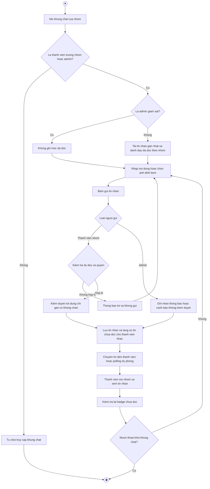

# 2.2.2.16 Mô hình hóa quy trình nghiệp vụ Chat nhóm

> **Tác nhân**: Thành viên nhóm, Trưởng nhóm, Admin · **Tài liệu kỹ thuật**: [file #10](../10-chat-nhom.md) · **Test case**: `TC-CHAT`

## a. Bằng văn bản

**Use case nghiệp vụ: Chat nhóm**

Use case bắt đầu khi thành viên của một nhóm cần trao đổi công việc chung trong khung trò chuyện của nhóm, hoặc khi quản trị viên cần gửi thông báo, cảnh báo đến một nhóm cụ thể.

**Các dòng cơ bản:**

1. Thành viên mở khung chat của nhóm từ trang chi tiết nhóm hoặc từ màn hình chat.
2. Hệ thống kiểm tra quyền truy cập khung chat nhóm.
3. Hệ thống tải các tin nhắn gần nhất và đánh dấu đã đọc cho riêng nhóm này.
4. Thành viên nhập nội dung, có thể chọn ảnh đính kèm.
5. Thành viên bấm gửi tin nhắn.
6. Hệ thống kiểm duyệt nội dung, lưu tin nhắn và tăng số tin chưa đọc cho các thành viên khác.
7. Hệ thống chuyển tin đến các thành viên và các thành viên mở nhóm để xem.
8. Thành viên kiểm tra lại badge chưa đọc theo nhóm và badge tổng trên thanh điều hướng.

**Các dòng thay thế**

Tại bước 2: Nếu người dùng không phải thành viên, không phải trưởng nhóm và không phải quản trị viên thì hệ thống từ chối truy cập khung chat nhóm và kết thúc use case.

Tại bước 3: Nếu người dùng là quản trị viên đang giám sát thì hệ thống không ghi nhận trạng thái đã đọc cho quản trị viên và tiếp tục bước 4.

Tại bước 5: Nếu người dùng không thuộc nhóm mà gửi tin nhắn thường thì hệ thống từ chối, thông báo không thể gửi tin nhắn vào nhóm này và tiếp tục bước 8.

Tại bước 5: Nếu quản trị viên gửi tin nhắn thì hệ thống chỉ nhận loại thông báo hoặc cảnh báo, không kiểm duyệt nội dung của quản trị viên, không tạo thành viên nhóm cho quản trị viên và tiếp tục bước 6.

Tại bước 5: Nếu ảnh vượt quá 5MB hoặc nội dung vượt quá 1000 ký tự thì hệ thống thông báo lỗi và quay lại bước 4.

Tại bước 7: Nếu hệ thống thời gian thực không hoạt động thì khung chat vẫn hỏi lại máy chủ theo chu kỳ để lấy các tin nhắn mới hơn, nhờ đó thành viên không bỏ sót thông báo hoặc cảnh báo

Tại bước 8: Nếu thành viên muốn xem thông tin nhóm hoặc thoát khỏi khung chat thì quay lại bước 1, ngược lại kết thúc use case

## b. Sơ đồ hoạt động

Đối chiếu code: `GET /groups/{groupId}/chat` (`groups.chat.show`), `POST /groups/{groupId}/chat/send` (`groups.chat.send`), `POST /groups/{groupId}/chat/read` (`groups.chat.read`), `GET /groups/{groupId}/chat/messages` (`groups.chat.messages`) → `GroupsChatController` + `GroupChatService::send()/isMember()`; `ChatUnreadService::markGroupRead()`; bảng `chat_messages` (`type` = member/announcement/warning), `group_chat_reads`; sự kiện `NewChatMessage`; admin gửi tin qua `admin.chat.message.group`.
