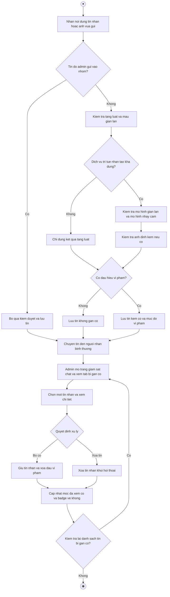

# 2.2.2.17 Mô hình hóa quy trình nghiệp vụ Kiểm duyệt nội dung chat

> **Tác nhân**: Hệ thống (kiểm duyệt tự động), Admin (xử lý cờ) · **Tài liệu kỹ thuật**: [file #13](../13-kiem-duyet-noi-dung.md), [file #14](../14-admin-giam-sat-chat.md) · **Test case**: `TC-MOD`

## a. Bằng văn bản

**Use case nghiệp vụ: Kiểm duyệt nội dung chat**

Use case bắt đầu khi người dùng gửi tin nhắn hoặc ảnh trong chat cá nhân hay chat nhóm và hệ thống cần đánh giá nội dung để kịp thời phát hiện các dấu hiệu vi phạm.

**Các dòng cơ bản:**

1. Hệ thống nhận nội dung tin nhắn hoặc ảnh vừa được gửi.
2. Hệ thống kiểm tra nội dung theo ba tầng: bộ luật và mẫu gian lận, mô hình phát hiện gian lận, mô hình phát hiện nội dung nhạy cảm nhiều nhãn.
3. Hệ thống kiểm tra ảnh đính kèm (nếu có) và xác định mức độ vi phạm.
4. Hệ thống lưu tin nhắn kèm cờ vi phạm và vẫn chuyển tin đến người nhận bình thường.
5. Quản trị viên mở trang giám sát chat và xem danh sách tin nhắn bị gắn cờ.
6. Quản trị viên chọn một tin nhắn và xem nội dung chi tiết.
7. Quản trị viên chọn bỏ cờ (nếu xác định không vi phạm) hoặc xóa tin nhắn.
8. Hệ thống cập nhật kết quả và quản trị viên kiểm tra lại danh sách tin nhắn bị gắn cờ.

**Các dòng thay thế**

Tại bước 2: Nếu dịch vụ trí tuệ nhân tạo không hoạt động hoặc không phản hồi thì hệ thống chỉ dùng bộ luật để kiểm tra, việc gửi tin vẫn thành công bình thường và tiếp tục bước 3.

Tại bước 4: Nếu tin nhắn không vi phạm thì hệ thống lưu tin không kèm cờ, tin không xuất hiện trong tab bị gắn cờ và tiếp tục bước 5.

Tại bước 2: Nếu tin nhắn là thông báo hoặc cảnh báo do quản trị viên gửi vào nhóm thì hệ thống không kiểm duyệt, không gắn cờ và tiếp tục bước 4.

Tại bước 7: Nếu quản trị viên chọn bỏ cờ thì hệ thống giữ nguyên tin nhắn và xóa dấu vi phạm, sau đó tiếp tục bước 8.

Tại bước 7: Nếu quản trị viên chọn xóa tin nhắn thì hệ thống xóa nội dung khỏi hội thoại và tiếp tục bước 8.

Tại bước 8: Nếu quản trị viên muốn xử lý thêm tin khác thì quay lại bước 5, ngược lại kết thúc use case. Khi mở tab bị gắn cờ, hệ thống đưa badge cảnh báo về không và đếm lại từ đầu khi có tin bị gắn cờ mới

## b. Sơ đồ hoạt động

Đối chiếu code: `TextModerationService`, `SensitiveModerationService`, `ImageModerationService`, `FlagHelper::merge()`; cột `direct_messages.is_flagged/flagged_at`, `chat_messages.is_flagged`; `GET admin/chat-monitor` (`admin.chat.monitor`), `admin.chat.flagged-count`, `PATCH admin/chat-monitor/direct|group/{id}/unflag`, `DELETE admin/chat-monitor/direct|group/{id}` → `AdminChatMonitorController`; `users.flagged_seen_at`.
