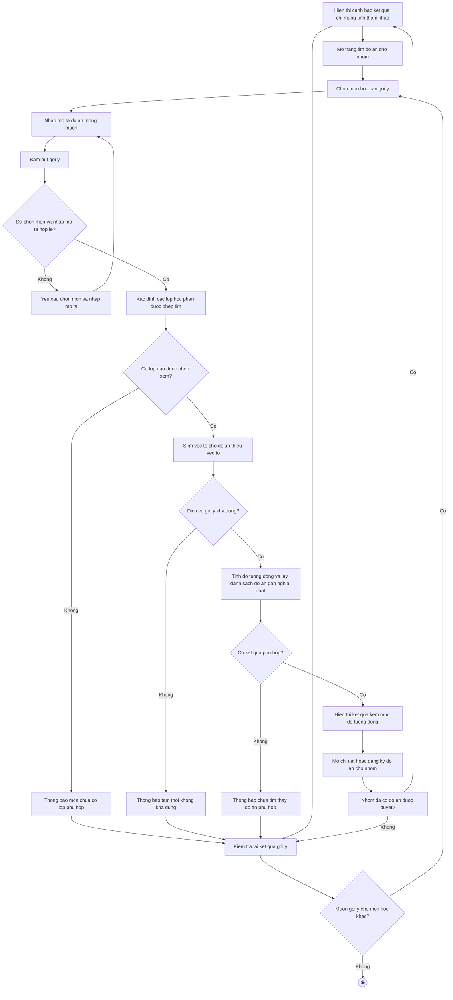

# 2.2.2.18 Mô hình hóa quy trình nghiệp vụ Gợi ý đồ án theo ngữ nghĩa

> **Tác nhân**: Sinh viên, Giảng viên, Admin · **Tài liệu kỹ thuật**: [file #18](../18-goi-y-de-tai-ngu-nghia.md) · **Test case**: `TC-REC`

## a. Bằng văn bản

**Use case nghiệp vụ: Gợi ý đồ án theo ngữ nghĩa**

Use case bắt đầu khi sinh viên chưa xác định được đồ án cụ thể và muốn mô tả bằng ngôn ngữ tự nhiên điều mà nhóm mình mong muốn thực hiện để hệ thống gợi ý những đồ án gần nghĩa nhất.

**Các dòng cơ bản:**

1. Sinh viên mở trang tìm đồ án cho nhóm.
2. Sinh viên chọn môn học cần gợi ý.
3. Sinh viên nhập mô tả đồ án mà nhóm mong muốn thực hiện.
4. Sinh viên bấm nút gợi ý.
5. Hệ thống xác định phạm vi lớp học phần được phép tìm theo vai trò và theo môn học đã chọn.
6. Hệ thống sinh véc-tơ cho các đồ án chưa có véc-tơ và tính độ tương đồng với mô tả của sinh viên.
7. Hệ thống hiển thị danh sách đồ án gần nghĩa nhất kèm mức độ tương đồng.
8. Sinh viên mở chi tiết một đồ án trong kết quả hoặc đăng ký đồ án cho nhóm.
9. Sinh viên kiểm tra lại kết quả gợi ý khi thay đổi mô tả.

**Các dòng thay thế**

Tại bước 4: Nếu sinh viên chưa chọn môn học thì hệ thống yêu cầu chọn môn học cần gợi ý và quay lại bước 2.

Tại bước 4: Nếu sinh viên không nhập mô tả (hoặc mô tả ngắn hơn 3 ký tự) thì hệ thống yêu cầu nhập mô tả đồ án mà nhóm muốn làm và quay lại bước 3.

Tại bước 5: Nếu môn học đã chọn không có lớp học phần nào mà người dùng được phép xem thì hệ thống thông báo môn học chưa có lớp học phần phù hợp và tiếp tục bước 9.

Tại bước 5: Nếu người dùng truyền mã lớp học phần mà mình không tham gia thì hệ thống từ chối truy cập, thông báo không có quyền xem đồ án của lớp này và tiếp tục bước 9.

Tại bước 6: Nếu dịch vụ gợi ý không hoạt động hoặc trả lỗi thì hệ thống thông báo tạm thời không khả dụng, các chức năng tìm kiếm và đăng ký đồ án vẫn hoạt động bình thường, sau đó tiếp tục bước 9.

Tại bước 7: Nếu không có đồ án nào đủ gần với mô tả thì hệ thống thông báo chưa tìm thấy đồ án phù hợp và gợi ý mô tả chi tiết hơn, sau đó tiếp tục bước 9.

Tại bước 7: Nếu nhóm đã có đồ án được duyệt thì hệ thống hiển thị cảnh báo kết quả gợi ý chỉ mang tính tham khảo và tiếp tục bước 8.

Tại bước 9: Nếu sinh viên muốn gợi ý cho môn học khác thì quay lại bước 2, ngược lại kết thúc use case.

## b. Sơ đồ hoạt động

Đối chiếu code: `POST /api/recommend` (`api.recommend`) → `TopicRecommendationController::recommend()` → `TopicRecommendationService::recommend()`, `TopicEmbeddingService::ensureFor()/store()`; bảng `topic_embeddings`; tham số bắt buộc `query`, `subject_id`; phạm vi lớp theo vai trò trong `allowedClassIds()`; cấu hình `TOPIC_RECOMMENDER_ENABLED`, `top_k`, `min_score`.
