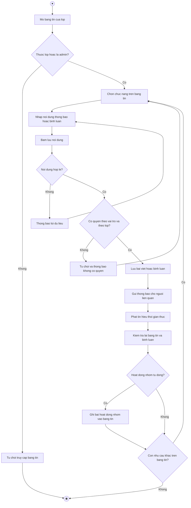

# 2.2.2.19 Mô hình hóa quy trình nghiệp vụ Bảng tin lớp học

> **Tác nhân**: Giảng viên, Sinh viên, Admin · **Tài liệu kỹ thuật**: [file #19](../19-bang-tin-lop-hoc.md) · **Test case**: `TC-STREAM`

## a. Bằng văn bản

**Use case nghiệp vụ: Bảng tin lớp học**

Use case bắt đầu khi giảng viên phụ trách lớp cần đăng thông báo cho toàn bộ sinh viên của lớp học phần, hoặc khi sinh viên cần theo dõi thông báo và hoạt động nhóm của lớp mình.

**Các dòng cơ bản:**

1. Người dùng mở bảng tin của lớp và xem các bài viết mới nhất.
2. Người dùng chọn chức năng trên bảng tin (đăng thông báo, bình luận, ghim hoặc xóa bài viết).
3. Người dùng nhập nội dung thông báo hoặc nội dung bình luận.
4. Người dùng bấm lưu nội dung.
5. Hệ thống kiểm tra quyền theo vai trò và theo lớp.
6. Hệ thống lưu bài viết hoặc bình luận và gửi thông báo cho người liên quan.
7. Hệ thống phát tín hiệu thời gian thực để bảng tin của các thành viên khác tự cập nhật.
8. Người dùng kiểm tra lại bảng tin và các bình luận dưới bài viết.

**Các dòng thay thế**

Tại bước 1: Nếu người xem không thuộc lớp và không phải quản trị viên thì hệ thống từ chối truy cập bảng tin và kết thúc use case.

Tại bước 5: Nếu người đăng không phải giảng viên phụ trách lớp và không phải quản trị viên thì hệ thống từ chối, thông báo chỉ giảng viên phụ trách lớp hoặc quản trị viên được đăng thông báo và quay lại bước 2.

Tại bước 3: Nếu nội dung để trống, ngắn hơn 3 ký tự hoặc vượt quá 1000 ký tự đối với bài viết (500 ký tự đối với bình luận) thì hệ thống thông báo lỗi và quay lại bước 3.

Tại bước 5: Nếu người dùng chọn ghim hoặc xóa nhưng không có quyền với bài viết (không phải tác giả, không phải giảng viên phụ trách, không phải quản trị viên) thì hệ thống từ chối, thông báo không có quyền và quay lại bước 2.

Tại bước 6: Nếu người bình luận là tác giả bài viết hoặc tác giả bình luận gốc thì hệ thống không gửi thông báo cho chính họ và tiếp tục bước 7.

Tại bước 6: Nếu nhóm được thành lập, thêm hoặc rời thành viên, đổi trưởng nhóm, được duyệt hoặc gán đồ án, hoặc giải tán nhóm thì hệ thống tự động ghi thêm bài hoạt động nhóm vào bảng tin của lớp mà không cần giảng viên nhập tay

Tại bước 7: Nếu hệ thống thời gian thực hoặc ghi bảng tin gặp lỗi thì nghiệp vụ chính như tạo nhóm, duyệt đồ án vẫn thành công; dữ liệu cũ có thể được bổ sung vào bảng tin bằng lệnh backfill

Tại bước 8: Nếu người dùng muốn xem thêm bài cũ thì chọn tải thêm bài viết; hệ thống tải thêm theo từng trang và quay lại bước 2

## b. Sơ đồ hoạt động

Đối chiếu code: `GET/POST classes/{classId}/stream`, `PATCH classes/{classId}/stream/{post}/pin`, `GET/POST classes/{classId}/stream/{post}/comments`, `DELETE classes/{classId}/stream/comments/{comment}`, `DELETE classes/{classId}/stream/{post}` → `ClassStreamController` + `ClassStreamService` (`canView`, `canManage`, `canDeletePost`, `canDeleteComment`, `postAnnouncement`, `togglePin`, `logGroupActivity`); observer `GroupObserver`, `GroupMemberObserver`; bảng `class_posts`, `class_post_comments`; sự kiện `ClassPostCreated`, `ClassCommentCreated`; lệnh `php artisan class-stream:backfill`.
