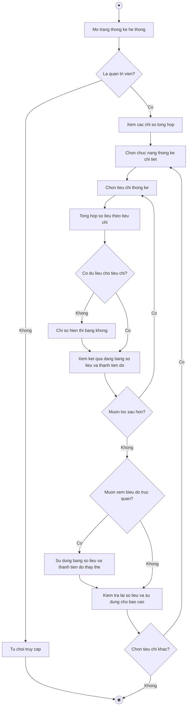

# 2.2.2.20 Mô hình hóa quy trình nghiệp vụ Thống kê hệ thống

> **Tác nhân**: Admin · **Tài liệu kỹ thuật**: [file #16](../16-thong-ke-he-thong.md), [file #17](../17-bieu-do-dashboard-admin.md) · **Test case**: `TC-STAT`

## a. Bằng văn bản

**Use case nghiệp vụ: Thống kê hệ thống**

Use case bắt đầu khi quản trị viên cần theo dõi tình hình người dùng, đồ án, nhóm và yêu cầu đăng ký đồ án để đánh giá hoạt động của các lớp học phần phục vụ báo cáo và ra quyết định.

**Các dòng cơ bản:**

1. Quản trị viên mở trang thống kê hệ thống.
2. Quản trị viên xem các chỉ số tổng hợp (tổng người dùng, tổng đồ án, tổng nhóm, tổng yêu cầu đăng ký, số yêu cầu đang chờ duyệt).
3. Quản trị viên chọn chức năng thống kê chi tiết (đồ án, nhóm, yêu cầu đăng ký hoặc người dùng).
4. Quản trị viên chọn tiêu chí thống kê (theo lớp học phần, theo giảng viên, theo trạng thái).
5. Hệ thống tổng hợp số liệu theo tiêu chí đã chọn.
6. Quản trị viên xem kết quả thống kê dạng bảng số liệu và thanh tiến độ.
7. Quản trị viên chọn tiêu chí khác nếu cần đối chiếu.
8. Quản trị viên kiểm tra lại số liệu và sử dụng cho báo cáo.

**Các dòng thay thế**

Tại bước 1: Nếu người truy cập không phải quản trị viên thì hệ thống từ chối truy cập các trang thống kê và kết thúc use case.

Tại bước 5: Nếu hệ thống chưa có dữ liệu cho một tiêu chí thì chỉ số tương ứng hiển thị bằng không, trang vẫn hoạt động bình thường và tiếp tục bước 6.

Tại bước 6: Nếu quản trị viên muốn lọc sâu hơn theo lớp học phần cụ thể thì chọn lại tiêu chí ở bước 4 và hệ thống tổng hợp lại số liệu.

Tại bước 6: Nếu quản trị viên cần trình bày dạng biểu đồ trực quan thì hiện hệ thống chưa có biểu đồ, quản trị viên sử dụng bảng số liệu và thanh tiến độ để thay thế.

Tại bước 7: Nếu quản trị viên chọn tiêu chí khác thì quay lại bước 3, ngược lại kết thúc use case.

## b. Sơ đồ hoạt động

Đối chiếu code: `GET admin/statistics` (`admin.statistics.index`), `admin.statistics.topics`, `admin.statistics.groups`, `admin.statistics.requests`, `admin.statistics.users` → `StatisticsController`; view `statistics/index|topics|groups|requests|users.blade.php`; trưởng nhóm suy ra từ `groups.leader_id`, sinh viên chưa có nhóm suy ra từ `group_members` và `groups.leader_id`.
