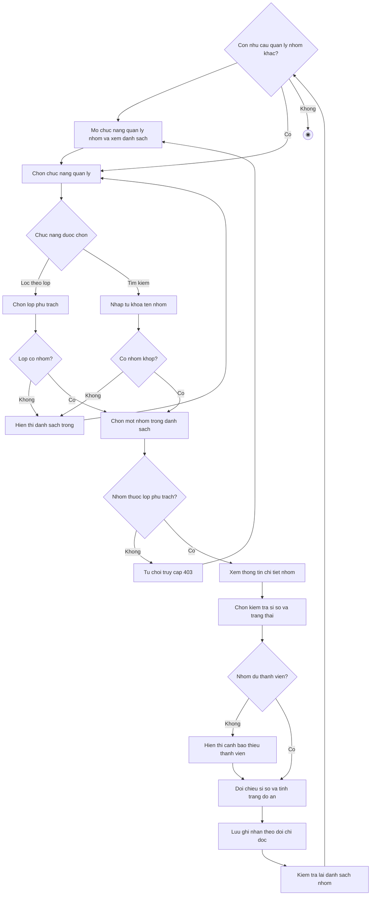

# 2.2.2.21 Mô hình hóa quy trình nghiệp vụ Quản lý nhóm (dành cho giảng viên)

> **Tác nhân**: Giảng viên · **Tài liệu kỹ thuật**: [file #8](../08-nhom-loi-moi-yeu-cau-tham-gia.md) · **Test case**: `TC-LECT`

## a. Bằng văn bản

**Use case nghiệp vụ: Quản lý nhóm (dành cho giảng viên)**

Use case bắt đầu khi giảng viên phụ trách lớp học phần cần kiểm tra danh sách nhóm trong các lớp mình phụ trách để theo dõi sĩ số, trưởng nhóm và tình trạng đăng ký đồ án của từng nhóm.

**Các dòng cơ bản:**

1. Giảng viên mở chức năng quản lý nhóm và xem danh sách nhóm thuộc các lớp mình phụ trách.
2. Giảng viên chọn chức năng quản lý (xem theo lớp hoặc tìm kiếm theo tên nhóm).
3. Giảng viên chọn một nhóm trong danh sách.
4. Giảng viên xem thông tin chi tiết nhóm (tên nhóm, lớp học phần, môn học, trưởng nhóm, danh sách thành viên, sĩ số hiện có và số thành viên tối đa, đồ án đã được duyệt).
5. Giảng viên chọn kiểm tra sĩ số và trạng thái nhóm.
6. Giảng viên đối chiếu sĩ số hiện có với số thành viên tối đa và tình trạng đồ án của nhóm.
7. Giảng viên lưu ghi nhận theo dõi (không thay đổi dữ liệu nhóm).
8. Giảng viên kiểm tra lại danh sách nhóm.

**Các dòng thay thế**

Tại bước 2: Nếu giảng viên chọn lọc theo lớp thì qua bước 3:

- Giảng viên chọn một lớp trong các lớp mình phụ trách
- Hệ thống chỉ hiển thị các nhóm thuộc lớp đã chọn và tiếp tục bước 3
- Nếu lớp đã chọn chưa có nhóm nào thì hệ thống hiển thị danh sách trống và quay lại bước 2

Tại bước 2: Nếu giảng viên nhập từ khóa tìm kiếm theo tên nhóm:

- Hệ thống lọc các nhóm thuộc lớp mình phụ trách khớp từ khóa và tiếp tục bước 3
- Nếu không có nhóm nào khớp thì hệ thống hiển thị danh sách trống và quay lại bước 2

Tại bước 3: Nếu giảng viên mở chi tiết một nhóm không thuộc lớp mình phụ trách thì hệ thống từ chối truy cập, thông báo không có quyền xem nhóm này và quay lại bước 1.

Tại bước 4: Nếu nhóm chưa đủ thành viên tối đa thì hệ thống hiển thị cảnh báo thiếu thành viên để giảng viên nhắc nhở, không cho can thiệp trực tiếp và tiếp tục bước 5.

Tại bước 4: Nếu giảng viên muốn can thiệp vào nhóm (sửa thông tin nhóm, thêm hoặc bớt thành viên, tạo nhóm thay sinh viên, gán đồ án thay nhóm trưởng) thì hệ thống không cung cấp chức năng, giảng viên chỉ theo dõi ở chế độ chỉ đọc và tiếp tục bước 5.

Tại bước 8: Nếu giảng viên còn nhu cầu quản lý nhóm khác thì quay lại bước 2, ngược lại kết thúc use case.

## b. Sơ đồ hoạt động

Đối chiếu code: `GET groups` (`groups.index`), `GET groups/{id}` (`groups.show`) → `GroupController::index()/show()` → `GroupService::maxMembers()`; kiểm tra quyền giảng viên qua `users.classes` (pivot `user_classes`); bảng `groups`, `group_members`, `class_sections`. Giảng viên ở chế độ chỉ đọc: không tạo, không sửa, không xóa nhóm.
