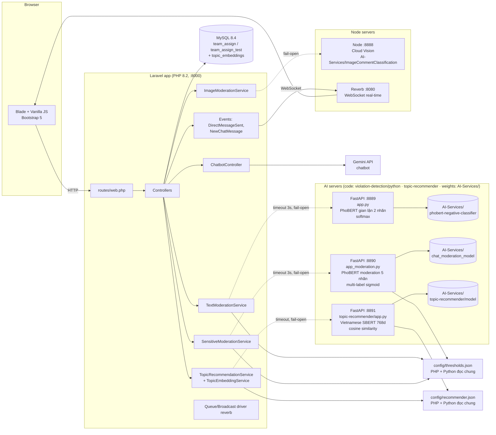

# Sơ đồ kiến trúc triển khai

## Nguyên tắc fail-open
- Mọi server phụ (8889, 8890, 8891, 8888, Reverb, Gemini) đều **không bắt buộc** để hệ thống hoạt động:
  chết/treo/timeout → tự fallback (kiểm duyệt về rules, gợi ý đề tài ẩn panel) hoặc bỏ qua,
  **không bao giờ chặn người dùng**.
- Model chạy CPU (không cần GPU); bật/tắt qua `.env` (`TEXT_MODERATION_MODE`, `MODERATION_MODE`,
  `VISION_MODERATION_URL`, `TOPIC_RECOMMENDER_ENABLED`).

## Nơi đặt code vs weights

| Phần | Vị trí |
|---|---|
| Code serve (FastAPI, PHP, Node) | trong repo: `violation-detection/python/`, `violation-detection/src/`, `app/Services/` |
| **Weights model kiểm duyệt** (2 × ~542 MB) | **ngoài repo**: `G:\MyApp\laragon\www\AI-Services\phobert-negative-classifier`, `...\chat_moderation_model` |
| **Service gợi ý đề tài** (code + docs + weights 515 MB + config) | **ngoài repo**: `G:\MyApp\laragon\www\AI-Services\topic-recommender\` (`app.py`, `README.md`, `MODEL_NOTES.md`, `config/recommender.json`, `model/`) |
| Node app Cloud Vision | **ngoài repo**: `G:\MyApp\laragon\www\AI-Services\ImageCommentClassification` |
| Bật / dừng cả 4 | `powershell -File G:\MyApp\laragon\www\AI-Services\start-servers.ps1` · `stop-servers.ps1` |

> Đường dẫn weights do env quyết định (`TEXT_MODEL_DIR`, `MODERATION_MODEL_DIR` trong `.env`)
> nên đổi chỗ model **không cần sửa code**. Chi tiết model + FAQ: `AI-Services/MODEL_INFO.md`.
