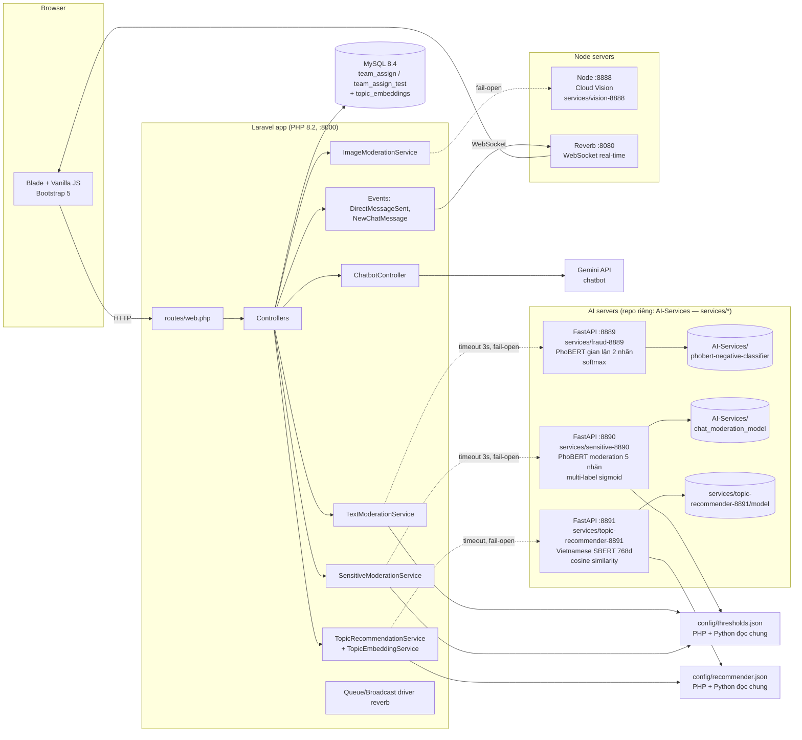

# Sơ đồ kiến trúc triển khai

```mermaid
graph LR
    subgraph Browser
        UI[Blade + Vanilla JS<br/>Bootstrap 5]
    end

    subgraph "Laravel app (PHP 8.2, :8000)"
        R[routes/web.php] --> C[Controllers]
        C --> S1[TextModerationService]
        C --> S2[SensitiveModerationService]
        C --> S3[ImageModerationService]
        C --> S4[TopicRecommendationService<br/>+ TopicEmbeddingService]
        C --> CH[ChatbotController]
        C --> EV[Events: DirectMessageSent,<br/>NewChatMessage]
        Q[Queue/Broadcast driver reverb]
    end

    subgraph "AI servers (repo riêng: AI-Services — services/*)"
        P1[FastAPI :8889<br/>services/fraud-8889<br/>PhoBERT gian lận 2 nhãn<br/>softmax]
        P2[FastAPI :8890<br/>services/sensitive-8890<br/>PhoBERT moderation 5 nhãn<br/>multi-label sigmoid]
        P3[FastAPI :8891<br/>services/topic-recommender-8891<br/>Vietnamese SBERT 768d<br/>cosine similarity]
        M1[(AI-Services/<br/>phobert-negative-classifier)]
        M2[(AI-Services/<br/>chat_moderation_model)]
        M3[(services/topic-recommender-8891/model)]
    end

    subgraph "Node servers"
        N1[Node :8888<br/>Cloud Vision<br/>services/vision-8888]
        N2[Reverb :8080<br/>WebSocket real-time]
    end

    DB[(MySQL 8.4<br/>team_assign / team_assign_test<br/>+ topic_embeddings)]
    GM[Gemini API<br/>chatbot]

    UI -->|HTTP| R
    EV -->|WebSocket| N2 --> UI
    S1 -.timeout 3s, fail-open.-> P1
    S2 -.timeout 3s, fail-open.-> P2
    S3 -.fail-open.-> N1
    S4 -.timeout, fail-open.-> P3
    CH --> GM
    C --> DB
    P1 --> M1
    P2 --> M2
    P3 --> M3
    S1 --> TH[config/thresholds.json<br/>PHP + Python đọc chung]
    S2 --> TH
    P2 --> TH
    S4 --> RC[config/recommender.json<br/>PHP + Python đọc chung]
    P3 --> RC
```

## Nguyên tắc fail-open
- Mọi server phụ (8889, 8890, 8891, 8888, Reverb, Gemini) đều **không bắt buộc** để hệ thống hoạt động:
  chết/treo/timeout → tự fallback (kiểm duyệt về rules, gợi ý đề tài ẩn panel) hoặc bỏ qua,
  **không bao giờ chặn người dùng**.
- Model chạy CPU (không cần GPU); bật/tắt qua `.env` (`TEXT_MODERATION_MODE`, `MODERATION_MODE`,
  `VISION_MODERATION_URL`, `TOPIC_RECOMMENDER_ENABLED`).

## Nơi đặt code vs weights

| Phần | Vị trí |
|---|---|
| Code PHP dùng trong app | trong repo này: `violation-detection/src/`, `app/Services/` |
| Code serve AI (FastAPI 8889/8890/8891 + Node 8888) | **repo riêng** [`AI-Services`](https://github.com/HuangMeii/AI-Services): `services/fraud-8889/`, `services/sensitive-8890/`, `services/topic-recommender-8891/`, `services/vision-8888/` |
| **Weights model kiểm duyệt** (2 × ~542 MB) | **repo AI-Services**: `phobert-negative-classifier/`, `chat_moderation_model/` (không commit — tải riêng, xem `docs/MODELS.md`) |
| **Weights model gợi ý đề tài** (~540 MB) | **repo AI-Services**: `services/topic-recommender-8891/model/` (tự tải bằng `download_model.py`) |
| Bật / dừng cả 4 service | trong repo AI-Services: `.\start-servers.ps1` · `.\stop-servers.ps1` (Windows) hoặc `bash start-servers.sh` · `bash stop-servers.sh` (Linux/macOS) |

## Bảng tin lớp học (chức năng #19) — thành phần liên quan

```mermaid
graph LR
    G[GroupService / TopicRegistrationService] -->|model events| OB[GroupObserver<br/>GroupMemberObserver]
    OB -->|fail-open| SS[ClassStreamService]
    GV[Giảng viên phụ trách] -->|đăng thông báo| CT[ClassStreamController]
    CT --> SS
    SS --> DB[(class_posts<br/>class_post_comments)]
    SS --> NS[NotificationService]
    NS -->|bell + Reverb| U[users.unread_notifications]
    SS -->|ClassPostCreated / ClassCommentCreated| RW[Reverb<br/>private class.{id}]
    SS -->|class-stream:backfill| DB
```

- **Observer tự ghi hoạt động nhóm** vào bảng tin lớp (không cần controller gọi tay); mọi lỗi bị nuốt
  trong `ClassStreamService` nên **không ảnh hưởng** luồng tạo nhóm / duyệt đề tài.
- **Realtime**: private channel `class.{classId}` (admin + thành viên lớp subscribe được).
- **Dữ liệu cũ**: `php artisan class-stream:backfill` (idempotent nhờ `source_key` unique).

> Đường dẫn weights do env quyết định (`TEXT_MODEL_DIR`, `MODERATION_MODEL_DIR` trong `.env`)
> nên đổi chỗ model **không cần sửa code**. Chi tiết model + FAQ: `AI-Services/MODEL_INFO.md`.
