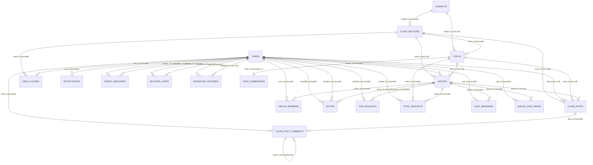

# 09 — Liên kết / quan hệ giữa các bảng

[← Mục lục](README.md) · File riêng theo yêu cầu · Xem danh sách FK chi tiết tại
[`08-foreign-keys.md`](08-foreign-keys.md)

---

## 1. Sơ đồ ERD (đúng theo FK thật trong DB)



> Bảng hạ tầng (`cache`, `cache_locks`, `jobs`, `job_batches`, `failed_jobs`, `sessions`,
> `migrations`) **không có quan hệ** với các bảng nghiệp vụ.

## 2. Cách đọc sơ đồ

| Ký hiệu | Nghĩa |
|---|---|
| `||--o{` | **1 – nhiều** (1 cha, 0..n con) |
| `||--o|` | **1 – 1** (tối đa 1 con: `topics` → `topic_embeddings`) |
| `cascade` / `set null` | hành vi `ON DELETE` của FK đó |
| `self` | tự tham chiếu (`class_post_comments.parent_id` → `class_post_comments.comment_id`) |

## 3. Ba trục liên kết chính của hệ thống

1. **Trục học vụ:** `subjects` → `class_sections` → `user_classes` (ai trong lớp) →
   `topics` (đề tài của lớp) → `groups` (nhóm trong lớp) → `group_members` (ai trong nhóm).
2. **Trục cộng tác:** `groups` ←→ `invites` / `join_requests` (kết nạp thành viên) →
   `topic_requests` (xin nhận đề tài) → ghi kết quả vào `groups.topic_id`.
3. **Trục giao tiếp:** `chat_messages` (nhóm) · `direct_messages` (1–1) · `group_chat_reads`
   (mốc đã đọc) · `blocked_users` (chặn) · `notifications` (chuông) · `class_posts` /
   `class_post_comments` (bảng tin lớp).

## 4. Quan hệ Eloquent tương ứng (đối chiếu `app/Models`)

| Model | Quan hệ khai báo trong code |
|---|---|
| `User` | `classes()` belongsToMany qua `user_classes`; `groupsJoined()` belongsToMany qua `group_members`; `groupsLed()` hasMany `groups.leader_id`; `invites()` (member_id), `sentInvites()` (invitedBy), `joinRequests()`; `blockedUsers()` hasMany `blocked_users.blocker_id`; accessor `has_group` = `is_leader \|\| Group_Members::where('user_id', …)->exists()` |
| `ClassSection` | `subject()` belongsTo; `groups()`, `topics()`, `posts()` hasMany; `users()` belongsToMany qua `user_classes`; `lecturers()` / `students()` = cùng belongsToMany nhưng lọc `users.role` |
| `Subject` | `classes()`, `topics()` hasMany |
| `Topics` | `subject()`, `class()` / `class_section()` belongsTo; `assignedGroup()` hasOne `groups.topic_id`; `topic_requests()` hasMany; `embedding()` hasOne `topic_embeddings`; scope `byClass()` |
| `Groups` | `leader()` belongsTo `users`; `topic()`, `class()` belongsTo; `members()` belongsToMany qua `group_members` (`withPivot('role','id')`, `withTimestamps()`); `chatMessages()`, `invites()`, `joinRequests()`, `topicRequests()` hasMany |
| `TopicEmbedding` | 1–1 với `Topics` qua `topic_id` (encode/decode vector base64 float32 LE) |
| `ClassPost` | belongsTo `class_sections`, `users`, `groups`, `topics`; hasMany `ClassPostComment` |
| `ClassPostComment` | belongsTo `class_posts`, `users`, `parent` (self) |
| `DirectMessage` | belongsTo `users` qua `sender_id` và `recipient_id` |
| `ChatMessage` | belongsTo `groups`, `users` |
| `GroupChatRead` | belongsTo `users`, `groups` |
| `BlockedUser` | belongsTo `users` qua `blocker_id` / `blocked_id`; static `isBlocked()` |
| `Notifications`, `Invites`, `Join_requests`, `Topic_requests`, `Group_Members`, `PasswordHistory`, `user_class` | quan hệ tương ứng theo cột FK như bảng ở [§08](08-foreign-keys.md) |

## 5. Liên kết đặc biệt cần lưu ý

| Trường hợp | Mô tả |
|---|---|
| **`groups.topic_id` là nguồn sự thật** | Đề tài nhóm đã được duyệt ghi ở `groups.topic_id` (FK SET NULL). `topics.assigned_group_id` **không có FK** và không được dùng để truy vấn. |
| **Bảng nối "có thuộc tính"** | `group_members` là N–N giữa `groups` ↔ `users` nhưng mang thêm `role` và timestamps. `user_classes` là N–N giữa `users` ↔ `class_sections` (phân biệt GV/SV qua `users.role`). |
| **Bảng nối "không có PK nghiệp vụ"** | `group_members`, `user_classes`, `blocked_users`, `group_chat_reads` đều có `id` tự tăng + UNIQUE trên cặp cột (chống trùng). |
| **1–1 tùy chọn** | `topics` ↔ `topic_embeddings`: chưa embed ⇒ chưa có hàng; xóa đề tài ⇒ xóa vector (cascade). |
| **Tự tham chiếu** | `class_post_comments.parent_id` → `comment_id` cho **reply 1 cấp**; xóa bình luận cha ⇒ xóa reply (cascade). |
| **"Soft FK" không ràng buộc** | `topics.lecturer` (text tên GV), `topics.assigned_group_id`, `notifications.type`, `chat_messages.type`, `class_posts.type`, `users.role`, `group_members.role` — ràng buộc nằm ở tầng code. |
| **Trùng lặp có chủ đích** | `groups.leader_id` và `group_members.role = 'leader'` cùng thể hiện nhóm trưởng (leader_id dùng để truy vấn nhanh, group_members để liệt kê thành viên). |
| **Mốc "đã đọc" phân tán** | chat nhóm → `group_chat_reads.last_read_at`; chat 1–1 → `direct_messages.is_read` + `seen_at`; thông báo → `notifications.is_read`; badge phụ → `users.*_seen_at`. |

## 6. Truy vấn mẫu theo liên kết

```php
// Sinh viên trong lớp + giảng viên phụ trách
$class->students;   // user_classes JOIN users WHERE users.role = 'student'
$class->lecturers;  // user_classes JOIN users WHERE users.role = 'lecturer'

// Nhóm của sinh viên trong 1 lớp cụ thể (thay cho users.isHaveGroup cũ)
Group_Members::where('user_id', $userId)->exists();

// Nhóm + đề tài đã nhận + trưởng nhóm
$group->load(['leader', 'topic', 'class', 'members']);

// Đề tài chưa được nhóm nào nhận trong lớp
Topics::byClass($classId)->whereDoesntHave('assignedGroup')->get();

// Tin chưa đọc của nhóm (so mốc đọc cuối)
$lastRead = GroupChatRead::where('user_id',$uid)->where('group_id',$gid)->value('last_read_at');
ChatMessage::where('group_id',$gid)->where('created_at','>',$lastRead ?? '1970-01-01')->count();
```

---

Quay lại: [Mục lục](README.md) · [08 — Khóa ngoại](08-foreign-keys.md) ·
[`../erd.md`](../erd.md)

