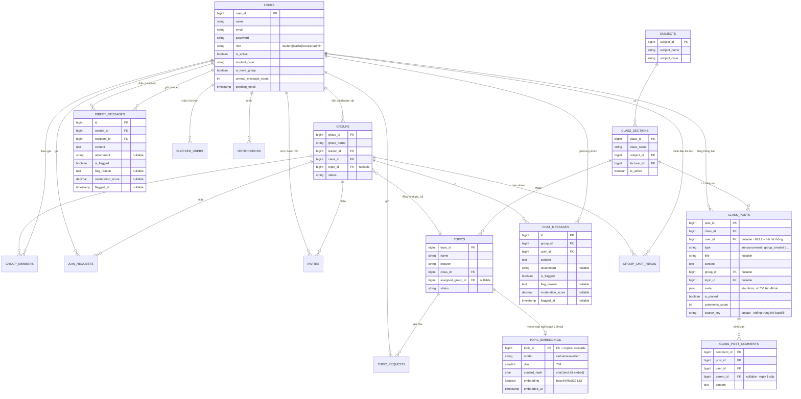

# ERD — Sơ đồ cơ sở dữ liệu (các bảng chính)

## Cột kiểm duyệt (thêm ở migration `2026_09_17_213035_add_flag_columns_to_chat_tables`)
- `chat_messages` và `direct_messages` cùng có: `is_flagged`, `flag_reason`, `moderation_score`, `flagged_at`.
- Chỉ mục `direct_messages (recipient_id, created_at)` phục vụ badge chưa đọc.

## `topic_embeddings` (thêm ở migration `2026_09_20_120000_create_topic_embeddings_table`)

Bảng phục vụ **gợi ý đề tài theo ngữ nghĩa** (chức năng #18):

- **1 hàng / đề tài** (PK `topic_id`, FK → `topics.topic_id` ON DELETE CASCADE) — vector chỉ sinh
  **một lần** rồi tái sử dụng, không embedding lại ở mỗi lần gợi ý.
- `embedding` = **base64(float32 little-endian)**, 768 chiều ⇒ ~4 KB/hàng. MySQL 8.4 chưa có kiểu
  `VECTOR` nên không lưu native và **không** có index vector; cosine similarity được tính ở
  service AI (`AI-Services/topic-recommender`, port 8891).
- `content_hash` = sha1 của text đã embed (`name + description + goal + requirements`) ⇒ đổi nội dung
  là biết ngay phải embed lại; `model` cho biết vector thuộc model nào (đổi model ⇒ embed lại toàn bộ).
- Chỉ mục `model` để liệt kê/đối chiếu nhanh theo model.

## `class_posts` + `class_post_comments` (migration `2026_09_22_1200xx_*`)

Hai bảng phục vụ **bảng tin lớp học** (kiểu Google Classroom, chức năng #19):

- `class_posts`: mỗi dòng là 1 bài trong bảng tin của lớp — **thông báo của giảng viên**
  (`type = announcement`, có `user_id`) hoặc **hoạt động nhóm do hệ thống ghi** (`type = group_*`,
  `user_id = NULL`). `meta` (json) giữ tên nhóm/số thành viên/tên đề tài để render không cần query thêm.
- `is_pinned`: bài ghim luôn nằm đầu bảng tin (`ORDER BY is_pinned DESC, created_at DESC`).
- `source_key` (UNIQUE, nullable): khoá chống trùng cho `php artisan class-stream:backfill`
  (vd `backfill:group:12:created`) ⇒ chạy lại nhiều lần **không nhân đôi** bài.
- `class_post_comments`: bình luận dưới bài; `parent_id` cho **trả lời 1 cấp**.
  `class_posts.comments_count` là cache số bình luận (tăng/giảm khi thêm/xoá).
