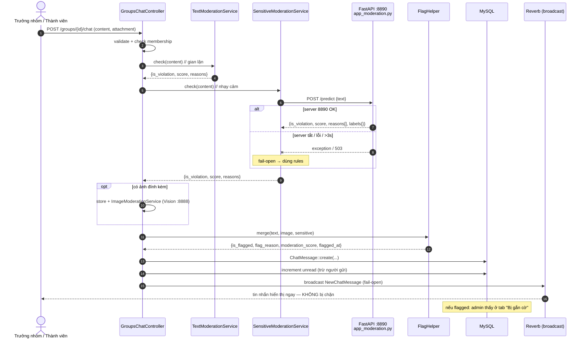
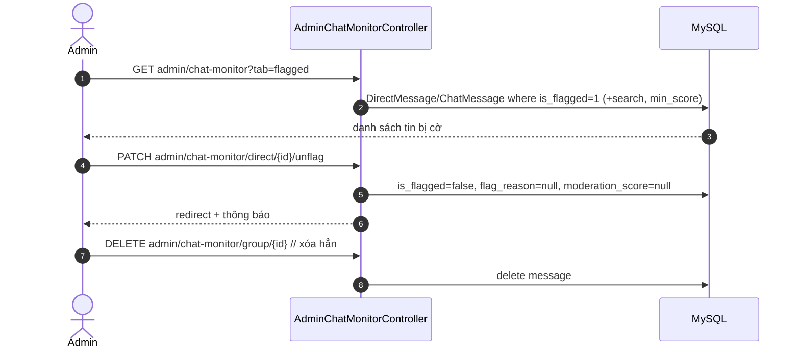

# Sequence diagram — Chat nhóm & Admin bỏ cờ

## 1) Gửi tin nhắn nhóm (qua 3 tầng kiểm duyệt)

```mermaid
sequenceDiagram
    autonumber
    actor U as Trưởng nhóm / Thành viên
    participant C as GroupsChatController
    participant T as TextModerationService
    participant S as SensitiveModerationService
    participant PY as FastAPI :8890<br/>app_moderation.py
    participant F as FlagHelper
    participant DB as MySQL
    participant R as Reverb (broadcast)

    U->>C: POST /groups/{id}/chat (content, attachment)
    C->>C: validate + check membership
    C->>T: check(content)          // gian lận
    T-->>C: {is_violation, score, reasons}
    C->>S: check(content)          // nhạy cảm
    S->>PY: POST /predict {text}
    alt server 8890 OK
        PY-->>S: {is_violation, score, reasons[], labels{}}
    else server tắt / lỗi / >3s
        PY--xS: exception / 503
        Note over S: fail-open → dùng rules
    end
    S-->>C: {is_violation, score, reasons}
    opt có ảnh đính kèm
        C->>C: store + ImageModerationService (Vision :8888)
    end
    C->>F: merge(text, image, sensitive)
    F-->>C: {is_flagged, flag_reason, moderation_score, flagged_at}
    C->>DB: ChatMessage::create(...)
    C->>DB: increment unread (trừ người gửi)
    C->>R: broadcast NewChatMessage (fail-open)
    R-->>U: tin nhắn hiển thị ngay — KHÔNG bị chặn
    Note over DB: nếu flagged: admin thấy ở tab "Bị gắn cờ"
```

## 2) Admin bỏ cờ / xóa tin nhắn

```mermaid
sequenceDiagram
    autonumber
    actor A as Admin
    participant M as AdminChatMonitorController
    participant DB as MySQL
    A->>M: GET admin/chat-monitor?tab=flagged
    M->>DB: DirectMessage/ChatMessage where is_flagged=1 (+search, min_score)
    DB-->>A: danh sách tin bị cờ
    A->>M: PATCH admin/chat-monitor/direct/{id}/unflag
    M->>DB: is_flagged=false, flag_reason=null, moderation_score=null
    M-->>A: redirect + thông báo
    A->>M: DELETE admin/chat-monitor/group/{id}   // xóa hẳn
    M->>DB: delete message
```
