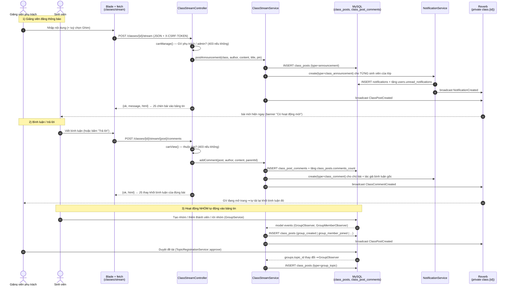

# Sequence — Bảng tin lớp học (kiểu Google Classroom)

> Chức năng #19 · `/classes/{id}/stream` · thông báo của giảng viên + hoạt động nhóm tự động + bình luận

## Ghi chú thiết kế

| Điểm | Chi tiết |
|---|---|
| Quyền | Đăng/ghim/xoá bài: GV **phụ trách lớp** hoặc admin · Xem/bình luận: thành viên lớp + GV phụ trách + admin · Xoá bình luận: tác giả / GV phụ trách / admin |
| Fail-open | Mọi thao tác ghi bảng tin nằm trong try/catch ⇒ lỗi KHÔNG làm hỏng tạo nhóm / duyệt đề tài (đã có test riêng) |
| Chống nhiễu | Observer bỏ qua thay đổi chỉ có `status`/`updated_at` ⇒ tạo nhóm chỉ sinh **1 bài** `group_created` (không thêm bài khi auto-update `status`) |
| Realtime | Private channel `class.{classId}` (admin + thành viên lớp subscribe được). Reverb tắt ⇒ trang vẫn chạy, chỉ không tự cập nhật |
| Backfill | `php artisan class-stream:backfill [--class=] [--dry-run] [--with-status]` sinh bài từ `groups` (group_created), `group_members` (group_member_joined), `topic_requests` Accepted (group_topic) và **giữ mốc thời gian gốc**; `source_key` unique ⇒ chạy lại KHÔNG nhân đôi |
| Không dựng lại được | Đổi tên nhóm / đổi trưởng nhóm / nhóm đã xoá (không có lịch sử) |
