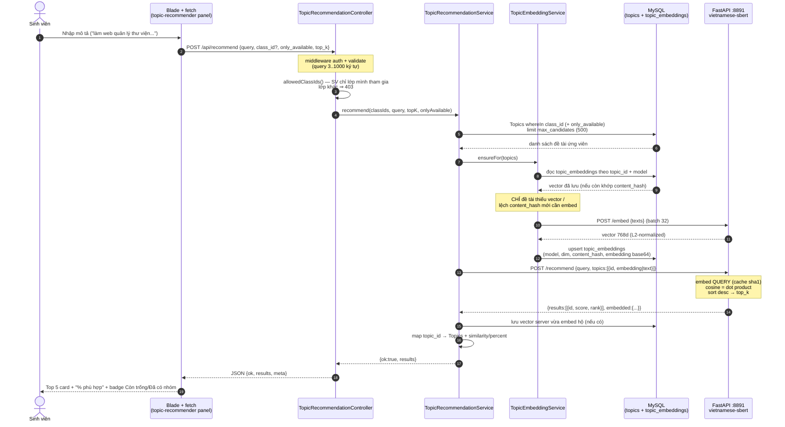

# Sequence — Gợi ý đề tài theo ngữ nghĩa (semantic recommendation)

> Chức năng #18 · `POST /api/recommend` · service AI `AI-Services/topic-recommender` (:8891)

## Ghi chú thiết kế

| Điểm | Chi tiết |
|---|---|
| **Không embedding lại đề tài** | Vector nằm ở `topic_embeddings`; lần gợi ý thứ 2 trở đi chỉ embed câu truy vấn (bước 12–13 bị bỏ qua) |
| Đổi nội dung đề tài | `content_hash` đổi ⇒ chỉ đề tài đó được embed lại (bước 10–13) |
| Đổi model | Đổi `TOPIC_RECOMMENDER_MODEL_TAG` ⇒ mọi đề tài được embed lại 1 lần (`php artisan topics:embed --force`) |
| Fail-open | `:8891` tắt/lỗi ⇒ service trả `ok:false` + message, HTTP **200** (UI hiện cảnh báo, không vỡ trang) |
| Giới hạn phạm vi | Sinh viên/giảng viên: chỉ lớp trong `user_classes`; admin: mọi lớp (hoặc 1 lớp nếu truyền `class_id`) |
| Ngưỡng & top_k | `config/recommender.json` (Python đọc) + `TOPIC_RECOMMENDER_TOP_K/MIN_SCORE` (Laravel) |
