# Use case diagram — Team-Assign

```mermaid
graph TB
    subgraph "Hệ thống Quản lý Đề tài Nhóm (Team-Assign)"
        UC1([Đăng nhập / Đăng ký / Quên mật khẩu])
        UC2([Quản lý hồ sơ, đổi email + xác thực email])
        UC3([Xem dashboard])

        subgraph Học vụ
            UC4([Xem / tìm lớp học phần])
            UC5([Đăng ký đề tài])
            UC6([Theo dõi trạng thái duyệt đề tài])
            UC20([Gợi ý đề tài theo NGỮ NGHĨA<br/>nhập mô tả → Top 5 gần nghĩa nhất])
        end

        subgraph "Lớp học (kiểu Google Classroom)"
            UC21([Đăng thông báo cho lớp])
            UC22([Xem BẢNG TIN của lớp])
            UC23([Bình luận / trả lời dưới bài viết])
            UC24([Hệ thống tự ghi HOẠT ĐỘNG NHÓM<br/>thành lập · thêm/rời TV · đổi trưởng nhóm · duyệt đề tài])
        end

        subgraph Nhóm
            UC7([Tạo / quản lý nhóm])
            UC8([Mời thành viên / duyệt yêu cầu tham gia])
            UC9([Rời / đóng nhóm])
        end

        subgraph Chat
            UC10([Chat 1-1])
            UC11([Chat nhóm])
            UC12([Gửi ảnh đính kèm])
            UC13([Chặn / bỏ chặn người dùng])
            UC14([Đánh dấu đã đọc - badge])
        end

        subgraph Admin
            UC15([Quản lý người dùng + import Excel + khóa/mở])
            UC16([Quản lý môn học + import])
            UC17([Quản lý lớp học phần])
            UC18([Giám sát chat: Bị gắn cờ, bỏ cờ, xóa tin])
            UC19([Broadcast thông báo tới nhóm / toàn hệ thống])
        end
    end

    ACTOR_SV((Sinh viên))
    ACTOR_LN((Trưởng nhóm))
    ACTOR_GV((Giảng viên))
    ACTOR_AD((Admin))

    ACTOR_SV --> UC1 & UC2 & UC3 & UC4 & UC10 & UC11 & UC12 & UC13 & UC14 & UC20 & UC22 & UC23
    ACTOR_LN --> UC7 & UC8 & UC9 & UC5 & UC20 & UC22 & UC23
    ACTOR_GV --> UC6 & UC16 & UC20 & UC21 & UC22 & UC23
    ACTOR_AD --> UC15 & UC16 & UC17 & UC18 & UC19 & UC21 & UC22

    UC10 & UC11 -.->|chạy qua| MOD((Kiểm duyệt<br/>3 tầng: rules +<br/>PhoBERT fraud +<br/>PhoBERT moderation))
    UC12 -.->|Vision kiểm duyệt ảnh| MOD
    UC18 -.->|xem & duyệt cờ| MOD

    UC7 & UC8 -.->|tự động sinh bài| UC24
    UC24 -.->|hiện trong| UC22
    UC20 -.->|embedding + cosine| REC((AI gợi ý đề tài<br/>:8891 · vietnamese-sbert))
```

## Ghi chú cập nhật
- **UC20** (gợi ý đề tài theo ngữ nghĩa): `POST /api/recommend` + service AI `AI-Services/topic-recommender` (:8891);
  xem `docs/diagrams/sequence-topic-recommendation.md`.
- **UC21–UC24** (bảng tin lớp học, kiểu Google Classroom): `ClassStreamController` + `ClassStreamService`;
  UC24 do observer (`GroupObserver`, `GroupMemberObserver`) tự ghi khi có thao tác nhóm, UC22 hiển thị cả
  thông báo của giảng viên và hoạt động nhóm; xem `docs/diagrams/sequence-class-stream.md`.

## Phân quyền theo vai trò
- **Sinh viên (student):** học vụ cá nhân, tham gia nhóm (qua mời hoặc yêu cầu), chat.
- **Trưởng nhóm (leader):** mọi quyền sinh viên + tạo nhóm, mời/duyệt thành viên, đăng ký đề tài cho nhóm.
- **Giảng viên (lecturer):** quản lý đề tài của mình, duyệt/từ chối đăng ký đề tài, xem lớp phụ trách.
- **Admin:** toàn quyền quản trị (users, subjects, classes) + giám sát chat + broadcast.
